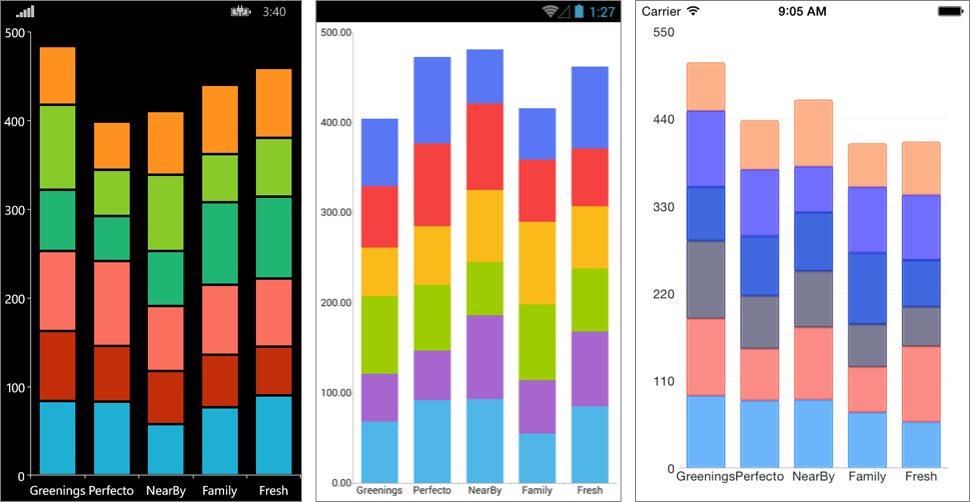

# CartegoricalSeries CombineMode #
When the series in a RadCartesianChart are more than one, a few different drawing strategies can be used. The possible strategies are:

- **None**: The series are not combined - each series is plotted independently.
- **Cluster**: Series are combined next to each other (applicable for BarSeries).
- **Stack**: Series form stacks.
- **Stack100**: Series form stacks that occupy 100% of the plot area and the characterictic size of each series is proportional to its relative value.

The default combine mode is **None**. You can get or set the current combine mode with the series CombineModeproperty.
# Example #
Here is an example that demonstrates how you can create BarSeries that are combined in stacks:

	var chart = new RadCartesianChart
	{
	    HorizontalAxis = new CategoricalAxis(),
	    VerticalAxis = new   NumericalAxis(),
	};
	
	for (var i = 0; i < 6; i++)
	{
	    var series = new BarSeries();
	    series.ItemsSource = CategoricalViewModel.GetCategoricalData();
	    series.ValueBinding = new PropertyNameDataPointBinding("Value");
	    series.CategoryBinding = new PropertyNameDataPointBinding("Category");
	    series.CombineMode = ChartSeriesCombineMode.Stack;
	
	    chart.Series.Add(series);
	}
Here is the result:  

Here is the same example with the other combine modes:
##### Stack100 #####

##### Cluster #####

