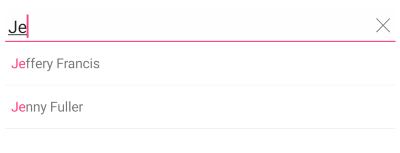
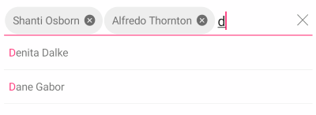
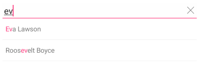
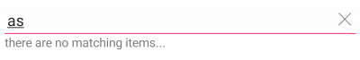
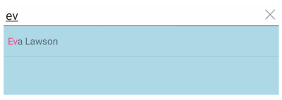

# Overview #

**Telerik AutoCompleteView for Xamarin Mobile Blazor Bindings** can automatically complete user input string by comparing the text being entered to all strings in the associated data source. The control has a number of advanced features such as different filtering options, tokens support, clear button and customization options.

#### Figure 1: RadAutoCompleteView Overview



## Key features

### Tokens Support

With RadAutoCompleteView you can enable users to search for and select several items in one control. These items appear as tokens that can easily be deselected using their close button.

**DisplayMode** ( of type `SuggestionsDisplayMode`) property determines whether a single or multiple selection is enabled. The default DisplayMode is "Plain", for multiple selection you would need to set it to "Tokens".

```
<RadAutoCompleteView ItemsSource="@AcvItemSource"
					 TextSearchPath="Name"
					 BackgroundColor="Color.White"
					 DisplayMode="Telerik.XamarinForms.Input.AutoComplete.SuggestionsDisplayMode.Tokens" />
```
							 


### Filtering Options

Through the **CompletionMode** property (of type `CompletionMode`) you can define the filtering behavior to display all the matches that either "StartsWith" (default) or "Contains" the typed symbols. 

```
<RadAutoCompleteView ItemsSource="@AcvItemSource"
					 TextSearchPath="Name"
					 CompletionMode="Telerik.XamarinForms.Input.AutoComplete.CompletionMode.Contains" />
```							 



### Watermark

**Watermark** property is used to give guidance to the end user on what should be entered in the text input. The watermark text is displayed when the control is empty. You can also use the **WatermarkTextColor** property to define the Watermark text color of the component.

```
<RadAutoCompleteView ItemsSource="@AcvItemSource"
					 TextSearchPath="Name"
					 Watermark="Enter name..."
					 WatermarkTextColor="Color.LightBlue" />
```


### NoResults Message

NoResults message appears in the popup used for the list of suggestions whenever the control cannot find any matching items. You can modify the message text through **NoResultsMessage** property:

```
<RadAutoCompleteView ItemsSource="@AcvItemSource"
                     TextSearchPath="Name"
                     NoResultsMessage="there are no matching items..." />
```	



###	Clear Button Visibility

The Clear button, which appears at the right side of the input field when the AutoCompleteView is on focus, gives the end-user the option to quickly clear the entered values. You could control the visibility of the button through the **IsClearButtonVisible** property.

```
<RadAutoCompleteView ItemsSource="@AcvItemSource"
					 TextSearchPath="Name"
					 IsClearButtonVisible="true" />
```							 

### Search Threshold

By default the search is triggered as soon as the user types into the input field. By using **SearchThreshold** you can configure AutoCompleteView to trigger the search after a certain number of letters is entered.

```
<RadAutoCompleteView ItemsSource="@AcvItemSource"
					 TextSearchPath="Name"
					 SearchThreshold="3" />
```

### Show/Hide SuggestionView

You can control the visibility of the popup containing the search results of the AutoCompleteView through **ShowSuggestionView** property. In addition, through the **SuggestionViewHeight** and **SuggestionViewBackgroundColor** properties you can customize the visual appearance of the popup.

``` 
<RadAutoCompleteView ItemsSource="@AcvItemSource" 
					 TextSearchPath="Name"
					 ShowSuggestionView="true"
					 SuggestionViewHeight="100"
					 SuggestionViewBackgroundColor="Color.LightBlue" />
```



## See Also

- [Getting Started]()
