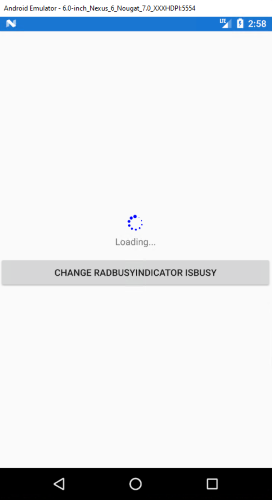
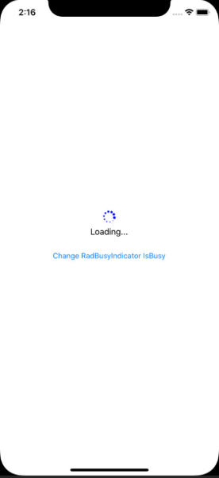

# Blazor Mobile Bindings for Xamarin

## Overview

[Experimental Mobile Blazor Bindings](https://docs.microsoft.com/en-us/mobile-blazor-bindings/) enable developers to create native mobile apps for iOS and Andoid using .Net and C#. The UI components and behaviors, which are based on Xamarin.Forms, are defined using the [Razor](https://docs.microsoft.com/en-us/aspnet/core/mvc/views/razor?view=aspnetcore-3.1) syntax. 
With Telerik mobile Blazor Bindings you can take full advantage of the Telerik UI for Xamarin suite in a Mobile Blazor Bindings project. 

The available controls which can be used in Mobile Blazor Bindings projects are listed in the table below: 

| Controls |
| -------- |
| RadBorder |
| RadButton |
| RadBusyIndicator |
| RadCheckBox |
| RadListView |
| RadSideDrawer |

## Getting Started with Telerik Xamarin Mobile Blazor Bindings

Let’s review the steps needed to get started with the Telerik UI for Xamarin controls in a Mobile Blazor Bindings project.

### 1. Setting up the project.

Let's begin with a new Xamarin Mobile Blazor project. Visit the [Getting Started](https://docs.microsoft.com/en-us/mobile-blazor-bindings/get-started) article in the Microsoft documentation. Now, we can start adding our Telerik Controls.

> For a faster quick-start, visit [Walkthrough: Creating your First App](https://docs.microsoft.com/en-us/mobile-blazor-bindings/walkthroughs/build-first-app).

### 2. Adding the required Telerik references

Let’s add the **RadBusyIndicator** to the project. To do this, we'll need to add the Telerik references that the RadBusyIndicator requires.

You have two options:

*	Add the Telerik UI for Xamarin Blazor Nuget package following the instructions from the [Telerik Nuget package server]() topic.

*	Add the references to Telerik assemblies manually, check the list bellow with the required assemblies for RadBusyIndicator component:

| Platform | Assemblies |
| -------- | ---------- |
| Portable | Telerik.XamarinForms.Blazor.Primitives.dll<br/>Telerik.XamarinForms.Primitives.dll |
| Android  | Telerik.Xamarin.Android.Primitives.dll<br/>Telerik.XamarinForms.Primitives.dll<br /> Telerik.XamarinForms.SkiaSharp.dll |
| iOS      | Telerik.Xamarin.iOS.dll <br/>Telerik.XamarinForms.Primitives.dll<br/>Telerik.XamarinForms.SkiaSharp.dll |

After that we need to add the Telerik.XamarinForms.Blazor.Primitives in our `_Imports.razor` page:

```C#
@using Telerik.XamarinForms.Blazor.Primitives;
```

>important RadBusyIndicator is rendered via the SkiaSharp graphics library so you need to install also **SkiaSharp.Views.Forms** in all projects of the xamarin solution (.NET Standard, Android, iOS).

### 3. Adding RadBusyIndicator control
	
3.1 Add new Razor component (lets call it RadBusyIndicatorPage.razor) and create the control inside:
		
```XML
<ContentView VerticalOptions="LayoutOptions.Center" >
	<RadBusyIndicator />
</ContentView>
```
	
3.2 Then use the RadBusyIndicatorPage component as MainPage for the application by modifying the App.cs:

```C#
public class App : Application
{
    public App()
    {
        var host = MobileBlazorBindingsHost.CreateDefaultBuilder()
            .ConfigureServices((hostContext, services) =>
            {
                // Register app-specific services
                //services.AddSingleton<AppState>();
            })
            .Build();

        MainPage = new ContentPage();
        host.AddComponent<RadBusyIndicatorPage>(parent: MainPage);
    }
    // ...
}
```

### 4. Customizations

4.1. Lets add a button that changes the IsBusy property of the RadBusyIndicator:
	
```XML
<ContentView>
	<StackLayout>
		<Button Text="Change RadBusyIndicator IsBusy" 
				OnClick="@ChangeIsBusy"/>
		<RadBusyIndicator IsBusy="@IsBusyIndicatorBusy"/>
	</StackLayout>
</ContentView>

@code {

	protected override void OnInitialized()
	{
		base.OnInitialized();

		this.IsBusyIndicatorBusy = true;
	}

	bool IsBusyIndicatorBusy { get; set; }

	void ChangeIsBusy()
	{
		this.IsBusyIndicatorBusy = !this.IsBusyIndicatorBusy;
	}
}
```

4.2 Customize RadBusyIndicator. Lets change its **AnimationContentColor** and **AnimationType**. Also let's add **Content** and **BusyContent**:
	
```XML
<RadBusyIndicator IsBusy="@IsBusyIndicatorBusy"	
				  AnimationContentColor="Color.Blue"                 
				  AnimationType="Telerik.XamarinForms.Primitives.AnimationType.Animation4">
    <Content>
        <Telerik.XamarinForms.Blazor.Primitives.BusyIndicator.Content>
            <Label Text="This is the content of the RadBusyIndicator control displayed when the indicator is not busy." />
        </Telerik.XamarinForms.Blazor.Primitives.BusyIndicator.Content>
    </Content>
    <BusyContent>
        <Telerik.XamarinForms.Blazor.Primitives.BusyIndicator.BusyContent>
            <Label HorizontalOptions="LayoutOptions.Center"
                   Text="Loading..."
                   VerticalOptions="LayoutOptions.Center" />
       </Telerik.XamarinForms.Blazor.Primitives.BusyIndicator.BusyContent>
    </BusyContent>
</RadBusyIndicator>
```

### 5. Run the application and see the result:

On Android:



On iOS:


