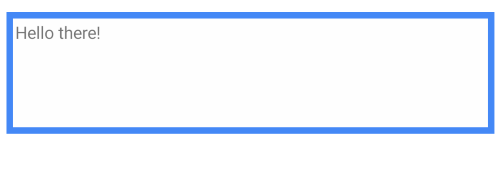

# Border for Xamarin Mobile Blazor Bindings

With the new **Telerik Border for Xamarin Mobile Blazor Bindings** component you will have full control over the look & feel of the border that wraps around your blazor component/view. You could surround any view such as Label, Image, and other, and specify different border thickness and corner radius on each side.

#### Figure 1: RadBorder Overview


## Key features

* **BorderThickness** and **BorderColor**: RadBorder provides a BorderThickness property which you can use together with BorderColor in order to have various types of borders around your views.

```
<RadBorder BorderColor="@Color.FromHex("#4488F6")"
           BorderThickness="new Thickness(5)"
           HeightRequest="100">
    <Label Text="Hello there!"
            Margin="new Thickness(2)" />
</RadBorder>
```



* **Defining different corner radius on each side**: Through the CornerRadius property you could specify separate corner radius value on all four angles of RadBorder.

```
<RadBorder BorderColor="@Color.FromHex("#4488F6")"
           CornerRadius="new Thickness(5)" 
		   HeightRequest="100">
    <Label Text="Hello there!"
            Margin="new Thickness(2)" />
</RadBorder>
```

Here is the result:


## See Also

- [Getting Started]()
- [Key Features]()
