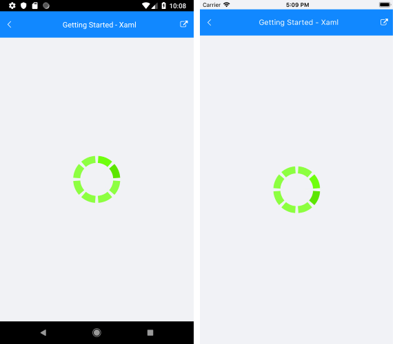

# Getting Started

This article will guide you through the steps needed to add a basic **RadBusyIndicator** control in your application.

## 1. Setting up the app

Take a look at the [Getting Started](#getting-started) article how to setup the Telerik Blazor Mobile Bindings for Xamarin project.

## 2. Adding the required Telerik references

Let’s add the **RadBusyIndicator** to the project. To do this, we'll need to add the Telerik references that the RadBusyIndicator requires.

You have two options:

*	Add the Telerik.UI.for.Xamarin.Blazor Nuget package following the instructions from the [Telerik Nuget package server]() topic.

*	Add the references to Telerik assemblies manually, check the list bellow with the required assemblies for RadBusyIndicator component:

| Platform | Assemblies |
| -------- | ---------- |
| Portable | Telerik.XamarinForms.Blazor.Primitives.dll<br/>Telerik.XamarinForms.Primitives.dll |
| Android  | Telerik.Xamarin.Android.Primitives.dll<br/>Telerik.XamarinForms.Primitives.dll<br /> Telerik.XamarinForms.SkiaSharp.dll |
| iOS      | Telerik.Xamarin.iOS.dll <br/>Telerik.XamarinForms.Primitives.dll<br/>Telerik.XamarinForms.SkiaSharp.dll |

After that we need to add the Telerik.XamarinForms.Blazor.Primitives in our `_Imports.razor` page:

```C#
@using Telerik.XamarinForms.Blazor.Primitives;
```

>important RadBusyIndicator is rendered via the SkiaSharp graphics library so you need to install also **SkiaSharp.Views.Forms** in all projects of the xamarin solution (.NET Standard, Android, iOS).

## 3. Adding RadBusyIndicator control

The busy indicator is a layout control that can display two views depending on its current state - busy and not-busy. You can define the state of the control via its **IsBusy** property. The default value is False and the control's normal content is displayed. If you change it to True, the busy content is displayed, which by default is a spinning balls animation. Check the [Animations]() article to see the built-in animations, how to change them and how to us a custom animation.

```
<RadBusyIndicator AnimationContentHeightRequest="100"
                    AnimationContentWidthRequest="100"
                    IsBusy="true">
    <Content>
        <Telerik.XamarinForms.Blazor.Primitives.BusyIndicator.Content>
            <Label Text="This is the content of the RadBusyIndicator control displayed when the indicator is not busy." />
        </Telerik.XamarinForms.Blazor.Primitives.BusyIndicator.Content>
    </Content>
</RadBusyIndicator>
```

And the result when RadBusyIndicator `IsBusy` is `True`



### See Also

- [Xamarin Mobile Blazor Bindings Overview]()
