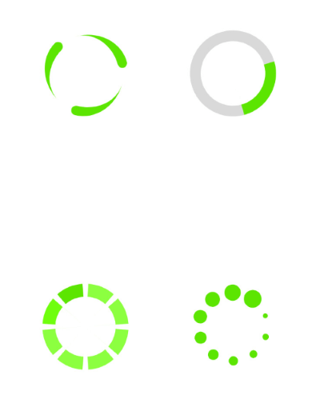
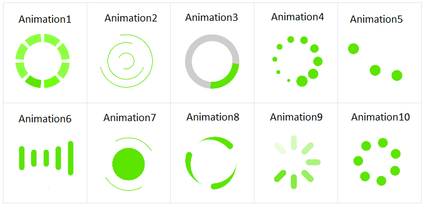
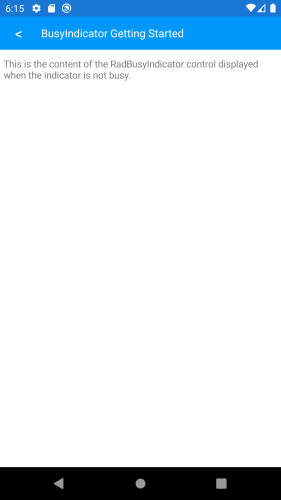
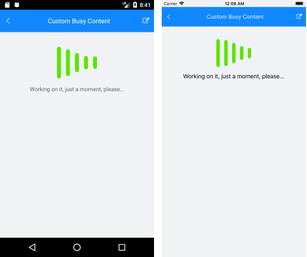

# BusyIndicator for Xamarin Mobile Blazor Bindings

**Telerik BusyIndicator for Xamarin Mobile Blazor Bindings** allows you to display a notification whenever a longer-running process is being handled by the application. This makes the UI more informative and the user experience smoother.

#### Figure 1: RadBusyIndicator Overview

 

## Key features

### Built-in Animations 

The busy indicator component provides few built-in animations which you can use. RadBusyIndicator provides a set of built-in animations which you can use. They can be changed via the `AnimationType` property.

The property is an enum called AnimationType and it accepts values named `Animation1` to `Animation10`. `Animation1`, `Animation2`, `Animation3`, etc. to `Animation10`. `Animation1` is the default one.

 

* **Changing animation size and color**: You can set the size of the animation content, which is the animated element. This can be done via the `AnimationContentWidthRequest` and `AnimationContentHeightRequest` properties. By default the size of the default animation content is 25x25 pixels.

You can also change the color of the animation with the AnimationContentColor property.

The snippet below shows how you can configure the predefined animations of RadBusyIndicator:

```
<RadBusyIndicator AnimationContentHeightRequest="100"
                  AnimationContentWidthRequest="100"
                  AnimationType="Telerik.XamarinForms.Primitives.AnimationType.Animation2"
                  AnimationContentColor="Color.Blue"
                  IsBusy="true"/>
```

and the result:

 

### BusyContent

Content which is displayed when the `IsBusy` it `false`:

```
<RadBusyIndicator AnimationContentHeightRequest="100"
                  AnimationContentWidthRequest="100"
                  IsBusy="false">
    <Content>
        <Telerik.XamarinForms.Blazor.Primitives.BusyIndicator.Content>
            <Label Text="This is the content of the RadBusyIndicator control displayed when the indicator is not busy." />
        </Telerik.XamarinForms.Blazor.Primitives.BusyIndicator.Content>
    </Content>
</RadBusyIndicator>
```

and the result:

 

### Custom Busy Content

Setting `BusyContent` property of RadBusyIndicator allows you to display any content together with the built-in animations while the control is in Busy state. 

```
<RadBusyIndicator AnimationContentHeightRequest="100"
                    AnimationContentWidthRequest="100"
                    AnimationType="Telerik.XamarinForms.Primitives.AnimationType.Animation6"
                    IsBusy="true">
    <BusyContent>
        <Telerik.XamarinForms.Blazor.Primitives.BusyIndicator.BusyContent>
            <Label Text="This is the content of the RadBusyIndicator control displayed when the indicator is not busy." />
        </Telerik.XamarinForms.Blazor.Primitives.BusyIndicator.BusyContent>
    </BusyContent>
</RadBusyIndicator>
```

and the result:

 

## See Also

- [Getting Started]()