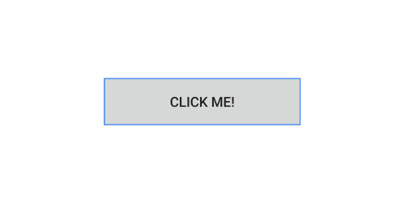

# Button for Xamarin Mobile Blazor Bindings

**Telerik Button for Xamarin Mobile Blazor Bindings** is a button control with includes the followiong feartures that allows you to add borders, transparency, text alignment, backgrounds and images. 



## Key features

* **Content alignment options**: With RadButton you will be able to apply different horizontal and vertical positioning of its content.
 
```
<RadButton Text="Text"
           HorizontalContentAlignment="Xamarin.Forms.TextAlignment.Center"
           VerticalContentAlignment="Xamarin.Forms.TextAlignment.Center" />
```

* **Setting Border Thickness**: RadButton provides a `BorderThickness` property which you can use together with `BorderColor` in order to have various types of borders around your buttons.
 
```
<RadButton Text="Click me!" 
           BorderThickness="new Thickness(6, 2, 2, 6)" 
           BorderColor="@Color.FromHex("#4488F6")" />
```

and the result:


* **Setting Background Image**: You can customize the appearance of RadButton by applying am image as its background.

```
<RadButton Text="Click me!" 
           BackgroundImage="@(new FileImageSource { File = "image.png" })" />
```

You can also use the `ImageSource` property. 

```
<RadButton Text="Click me!"
           ImageSource="@(new FileImageSource { File = "image.png" })" />
```

>tip Check out RadButton [Getting Started]() help article that shows how to use it in a basic scenario.

## See Also

- [Getting Started]()