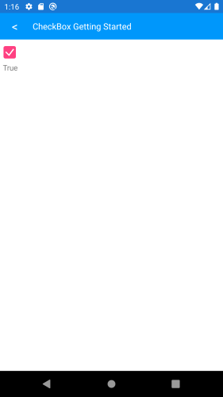

# Getting Started with CheckBox for Xamarin Mobile Blazor Bindings
   
This article will guide you through the steps needed to add a basic **RadCheckBox** control in your application.

* [Setting up the app](#1-setting-up-the-app)
* [Adding the required Telerik references](#2-adding-the-required-telerik-references)
* [Adding RadCheckBox control](#3-adding-radcheckbox-control)

## 1. Setting up the app

Take a look at the [Getting Started](#getting-started) article how to setup the Telerik Blazor Mobile Bindings for Xamarin project.

## 2. Adding the required Telerik references

You have two options:

* Add the Telerik.UI.for.Xamarin.Blazor Nuget package following the instructions from the [Telerik Nuget package server]() topic.

* Add the references to Telerik assemblies manually, check the list bellow with the required assemblies for RadCheckBox component:

| Platform | Assemblies |
| -------- | ---------- |
| Portable | Telerik.XamarinForms.Blazor.Primitives.dll <br/>Telerik.XamarinForms.Primitives.dll |
| Android  | Telerik.Xamarin.Android.Primitives.dll <br/>Telerik.XamarinForms.Primitives.dll |
| iOS      | Telerik.Xamarin.iOS.dll <br/>Telerik.XamarinForms.Primitives.dll |

## 3. Adding RadCheckBox control

RadCheckbox definition:

```
<ContentView>
    <StackLayout>
        <RadCheckBox IsChecked="@IsChecked" 
                     IsCheckedChanged="@OnCheckedChanged" />
        <Label Text="@IsCheckBoxChecked" />
    </StackLayout>
</ContentView>

@code
{
    public string IsCheckBoxChecked { get; set; }
    public bool IsChecked { get; set; }

    protected override void OnInitialized()
    {
        base.OnInitialized();

        this.IsChecked = false;
        this.IsCheckBoxChecked = this.IsChecked.ToString(); 
    }

    private void OnCheckedChanged(CheckBox.IsCheckedChangedEventArgs args)
    {
        this.IsCheckBoxChecked = args.NewValue.ToString();
    }
}
```

Here is the result:



## See Also

- [Xamarin Mobile Blazor Bindings Overview]()