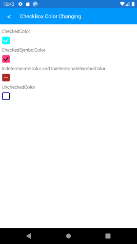
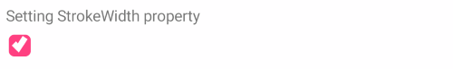
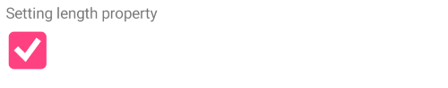

# CheckBox for Xamarin Mobile Blazor Bindings

**Telerik CheckBox for Xamarin Mobile Blazor Bindings** is a checkbox control which enables users to make a choice between three mutually exclusive options (checked, unchecked and indeterminate states). The user’s selection is indicated by a check mark, and when a user clicks the checkbox its appearance and state change.  

#### Figure 1: RadCheckBox Overview


## Key features

### Indeterminate state support

RadCheckBox provides an additional indeterminate state which indicates the control is neither checked nor unchecked. You will need to set `IsThreeState` property to `true`:

```
<RadCheckBox IsThreeState="true"/>
```

and the result: 


### Color customization 

RadCheckBox exposes a few useful Color properties for customizing its visual appearance. You could set the color of the check mark as well as the control itself in each of the available states.

 * Background/Border Colors
   * **CheckedColor**: Defines the Color applied to the control when it is checked. This is both the border and background color.
   * **UncheckedColor**: Defines the Color applied to the control when it is unchecked. This is the border color only, the background is transparent when unchecked.
   * **IndeterminateColor**: Defines the Color applied to the control when it is in Indeterminate state. This is both the border and background color.
 * Symbol Colors
   * **CheckedSymbolColor**: Defines the Color applied to the check symbol of the control when it is in Checked state.
   * **IndeterminateSymbolColor**: Defines the Color applied to the Indeterminate symbol of the control.

#### Example

Here is a sample checkbox definition with the above properties applied:

```
<StackLayout>
    <Label Text="CheckedColor" />
    <RadCheckBox CheckedColor="Color.Aqua" />
    <Label Text="CheckedSymbolColor" />
    <RadCheckBox CheckedSymbolColor="Color.Black" />
    <Label Text="IndeterminateColor and IndeterminateSymbolColor" />
    <RadCheckBox IndeterminateColor="Color.Brown"
                 IndeterminateSymbolColor="Color.Coral"
                 IsThreeState="true"/>
    <Label Text="UncheckedColor" />
    <RadCheckBox UncheckedColor="Color.DarkBlue" />
</StackLayout>
```

and the result:



### Stroke Width customization

The RadCheckBox control exposes a StrokeWidth property that specifies the width of the lines with which the Checkbox element is drawn. It affects the border of the control as well as the check mark.

Here is an example how you can apply a `StrokeWidth` value:

```
<RadCheckBox StrokeWidth="5" />
```

and the result:



### Different sizes

The width and height of the checkbox is controlled through the Length property and maintains a 1:1 aspect ratio.

Here is an example of setting the `Length` value:

```
<RadCheckBox StrokeWidth="5"
             Length="40" />
```

and the result:



## See Also

- [Getting Started]()