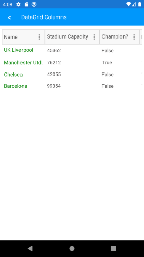

# RadDataGrid for Xamarin Mobile Blazor Bindings

Most of the data on the Internet is stored in tables within a database. **DataGrid for Xamarin Mobile Blazor Bindings** provides the same abstraction over the data – it has Columns and Rows and the intersection of a Row and a Column is called a Cell. When the data from a database is sent to the client, it is usually converted to a Business object (or the so-called ViewModel) where each instance represents a Table Row and each property of the object represents a Column within the original table.


## Key features

Below are describes the main features of the DataGrid control.

## Different Column Types

RadDataGrid provides plenty of built-in columns such as Text, Boolean, Numeric, Picket, DateTime. These pre-defined templates allow for handling different data types and user scenarios, each with its specific editor.

### Example

Here is an example with RadDataGrid Columns:

```
<Grid>
    <Layout>
        <RowDefinition GridUnitType="GridUnitType.Star" />
    </Layout>
    <Contents>
        <GridCell>
            <RadDataGrid ItemsSource="@Clubs" 
                         AutoGenerateColumns="false">
                <Columns>
                    <DataGridTextColumn PropertyName="Name"
                                        HeaderText="Name">
                        <CellContentStyle>
                            <DataGridTextCellStyle TextColor="Color.Green"
                                                   FontSize="15"
                                                   SelectedTextColor="Color.Orange" />
                        </CellContentStyle>
                    </DataGridTextColumn>
                    <DataGridNumericalColumn PropertyName="StadiumCapacity"
                                             HeaderText="Stadium Capacity" 
                                             CanUserFilter="false"/>
                    <DataGridBooleanColumn PropertyName="IsChampion"
                                           HeaderText="Champion?" 
                                           CanUserEdit="false"/>
                    <DataGridDateColumn PropertyName="Established"
                                        HeaderText="Date Established"
                                        CanUserGroup="false"/>
                    <DataGridPickerColumn PropertyName="Country"
                                          HeaderText="Country"
                                          ItemsSourcePath="Countries" />
                    <DataGridTimeColumn PropertyName="Time"
                                        HeaderText="Time Column" 
                                        CanUserSort="false"/>
                </Columns>
            </RadDataGrid>
        </GridCell>
    </Contents>
</Grid>

@code 
{
    public ObservableCollection<Club> Clubs { get; set; }
    
    protected override void OnInitialized()
    {
        base.OnInitialized();

        this.Clubs = new ObservableCollection<Club>
        {
            new Club("UK Liverpool ", new DateTime(1892, 1, 1), new DateTime(2018, 2, 22, 3, 28, 33), 45362, "England"),
            new Club("Manchester Utd.", new DateTime(1878, 1, 1), new DateTime(2018, 1, 1, 2, 56, 44), 76212, "England") { IsChampion = true },
            new Club("Chelsea", new DateTime(1905, 1, 1), new DateTime(2018, 6, 17, 6, 19, 59), 42055, "England"),
            new Club("Barcelona", new DateTime(1899, 1, 1), new DateTime(2018, 7, 12, 12, 25, 31), 99354, "Spain")
        };
    }
}

```

and the result:



## Editing

RadDataGrid provides a built-in editing functionality, which allows the app users to easily edit the data presented in the grid. Depending on the column data type, a relevant editor allows end users to edit content in a friendly environment.

You would need to define the `UserEditMode` property of the DataGrid control in order to enable the editing feature.

`UserEditMode` property is type of `Telerik.XamarinForms.DataGrid.DataGridUserEditMode` and accepts the following values:

* `None` - Editing is disabled (by default);
* `Cell` - Used to enable the editing option.

In addition, you could disable editing for concrete columns separately through the `CanUserEdit` property of the DataGridColumn class. 

Check the above Column example how the `CanUserEdit` property is set.

## Sorting

RadDataGrid provides you with a built-in sorting functionality, which allows the user to easily order the view of the data the control represents. Sorting the control is possible both through the UI.

In addition, you could disable sorting for concrete columns separately through the `CanUserSort` property of the DataGridColumn class. 

Check the above Column example how the `CanUserSort` property is set.

## Filtering

You can filter the DataGrid using the Filterin UI. The Filtering UI is opened when tapping on the **...** (three dots - Options Button) positioned inside the DataGrid header. 

You can set three different filter modes for the datagrid control using the `UserFilterMode` property. The property is of type `Telerik.XamarinForms.DataGrid.DataGridUserFilterMode`. The available options are: `Auto`, `Enabled` and `Disabled`.

In addition, you could disable editing for concrete columns separately through the `CanUserFilter` property of the DataGridColumn class. 

Check the above Column example how the `CanUserFilter` property is set.

## Grouping

You can group the DataGrid using the Filterin UI. The Filtering UI is opened when tapping on the **...** (three dots - Options Button) positioned inside the DataGrid header. 

You can set three different group modes for the datagrid control using the `UserGroupMode` property. The property is of type `Telerik.XamarinForms.DataGrid.DataGridUserGroupMode`. The available options are: `Auto`, `Enabled` and `Disabled`.

In addition, you could disable editing for concrete columns separately through the `CanUserGroup` property of the DataGridColumn class. 

>tip Check out RadDataGrid [Getting Started]() help article that shows how to use it in a basic scenario.

## See Also

- [Getting Started]() 
