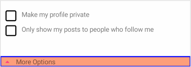
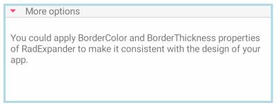

# Overview #

**Telerik Expander for Xamarin Mobile Blazor Bindings** helps you save screen space by presenting content in an expandable container that can be easily expanded/collapsed by tapping on the header of the control.

#### Figure 1: Expander Overview


## Key features

### Collapsed/expanded States

RadExpander provides an expandable container which can host any content. You can show or hide this content by interacting with the Header of the control. The default state of RadExpander is collapsed.

You can use `IsExpanded` Boolean property to switch the current state of the control.

### Expander Header

You can either apply `HeaderText` property or use the `ExpanderHeade`r content control which provides a set of useful properties for customizing the way the header looks. In addition, you can place the Header at the top or at the bottom of the expandable container through `HeaderLocation` property of type *ExpanderHeaderLocation*:

```
<RadExpander HeaderLocation="Telerik.XamarinForms.Primitives.ExpanderHeaderLocation.Bottom">
	<ExpanderHeader>
		<Telerik.XamarinForms.Blazor.Primitives.Expander.ExpanderHeader.ExpanderHeader 
							BackgroundColor="Color.LightSalmon"
							BorderColor="Color.Blue"
							BorderThickness="2">
			<Label Text="More Options" />
		</Telerik.XamarinForms.Blazor.Primitives.Expander.ExpanderHeader.ExpanderHeader>
	</ExpanderHeader>
	<ExpanderContent>
		<Telerik.XamarinForms.Blazor.Primitives.Expander.ExpanderContent>
			<StackLayout Margin="new Thickness(10, 20, 10, 20)">
				<StackLayout Orientation="StackOrientation.Horizontal"
							 Spacing="10">
					<RadCheckBox />
					<Label Text="Make my profile private" />
				</StackLayout>
				<StackLayout Orientation="StackOrientation.Horizontal"
							 Spacing="10">
					<RadCheckBox />
					<Label Text="Only show my posts to people who follow me" />
				</StackLayout>
			</StackLayout>
		</Telerik.XamarinForms.Blazor.Primitives.Expander.ExpanderContent>
	</ExpanderContent>
</RadExpander>
```



### Animation while expanding/collapsing

To enable or disable the animation you need to use the `IsAnimationEnabled` property of RadExpander. By default, the aimation is enabled.

You can also customize the duration and easing (acceleration over time) through `AnimationDuration`(in ms) and `AnimationEasing` (of type *Xamarin.Forms.Easing*). properties.

### Border Styling

RadExpander exposes `BorderColor` and `BorderThickness` properties which can help customize the control visual appearance:

```
<RadExpander HeaderText="More options"
			 BorderColor="Color.LightBlue"
			 BorderThickness="3">
	<ExpanderContent>
		<Telerik.XamarinForms.Blazor.Primitives.Expander.ExpanderContent>
			<StackLayout Margin="new Thickness(10, 20, 10, 20)">
				<Label Text="You could apply BorderColor and BorderThickness properties of RadExpander to make it consistent with the design of your app." />
			</StackLayout>
		</Telerik.XamarinForms.Blazor.Primitives.Expander.ExpanderContent>
	</ExpanderContent>
</RadExpander>
```							 




## See Also

- [Getting Started]()
