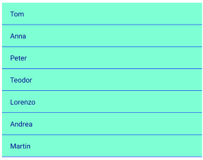

# Overview #

**Telerik ListView for Xamarin Mobile Blazor Bindings** is a virtualized list component that presents lists of data. It is quite useful in scenarios that require scrolling and manipulation of the items. The control is easy to use and packed with everything you may need from a ListView component – data binding, load on demand, filtering, grouping, sorting, customizable items, linear and grid layouts, item swipe and reordering, various selection options and more.

#### Figure 1: ListView Overview


## Key features

### Selection

RadListView supports both single and multiple selection, additionally items can be selected on tap or on hold gestures. 

```
<RadListView ItemsSource="@Source"
			 SelectionMode="Telerik.XamarinForms.DataControls.ListView.SelectionMode.Multiple"
			 SelectionGesture="Telerik.XamarinForms.DataControls.ListView.SelectionGesture.Tap" />
```


### Different layouts and orientation

You can choose between linear and grid layout as well as define the scroll direction of the layout.

```
<RadListView ItemsSource="@Source">
	<LayoutDefinition>
		<Telerik.XamarinForms.Blazor.DataControls.ListView.ListViewGridLayout SpanCount="2"
																			  ItemLength="40"
																			  HorizontalItemSpacing="5"
																			  VerticalItemSpacing="5" />
	</LayoutDefinition>
</RadListView>
```


### Reorder Items

You can allow the end-users to reorder ListView items using drag and drop through `IsItemsReorderEnabled` property.

```
<RadListView ItemsSource="@Source" 
			 IsItemsReorderEnabled="true" />
```

### Load on demand

In addition to the built-in UI virtualization, the control supports load-on-demand. This optimizes the initial loading of the app and the new items are loaded when requested - you can choose between Automatic (items are loaded when user scrolls near the end of the listview) or Manual (a button is rendered, when tapped, items a re loaded) load on demand mode:

```
<ContentView>
    <RadListView ItemsSource="@Source" 
                 IsLoadOnDemandEnabled="true"
                 LoadOnDemandMode="Telerik.XamarinForms.Common.LoadOnDemandMode.Manual"
                 OnLoadOnDemand="@LoadOndemandClicked"/>
</ContentView>

@code 
{
    public ObservableCollection<string> Source { get; set; }

    protected override void OnInitialized()
    {
        base.OnInitialized();

        this.Source = new ObservableCollection<string>()
        {
            "Tom",
            "Anna",
            "Peter",
            "Teodor",
            "Lorenzo",
            "Andrea",
            "Martin"
        };
    }

    protected void LoadOndemandClicked()
    {
        for(int i=0; i<5; i++)
        {
            this.Source.Add(String.Format("New item {0}", i));
        }
    }
}
```							 


### Grouping, sorting and filtering

You can easily visualize your items in groups, sorted and filtered in accordance with your criteria - just need to add the needed property descriptor to the `GroupDescriptors`, `SortDescriptors` or `FilterDescriptors` collections of the ListView, respectively.

### Customizable Items

RadListView provides styling mechanism for customizing the look of its items. This mechanism consists of the following properties of type **ListViewItemStyle**:

* ItemStyle
* SelectedItemStyle
* PressedItemStyle
* ReorderItemStyle

```
<RadListView ItemsSource="@Source">
	<ItemStyle>
		<Telerik.XamarinForms.Blazor.DataControls.ListView.ListViewItemStyle BackgroundColor="Color.Aquamarine"
																			 TextCellTextColor="Color.DarkBlue"
																			 BorderColor="Color.Blue"                                                
																			 BorderWidth="2" />
	</ItemStyle>
</RadListView>
```



## See Also

- [Getting Started]()
