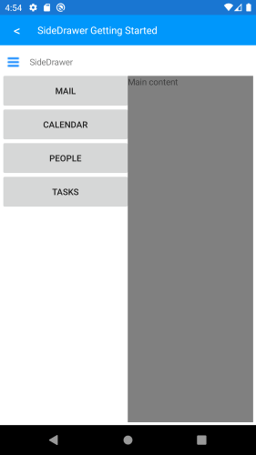

# Getting Started with SideDrawer for Xamarin Mobile Blazor Bindings

This article will guide you through the steps needed to add a basic **RadSideDrawer** control in your application.

## 1. Setting up the app

Take a look at the [Getting Started](#getting-started) article how to setup the Telerik Blazor Mobile Bindings for Xamarin project.

## 2. Adding the required Telerik references

You have two options:

* Add the Telerik.UI.for.Xamarin.Blazor Nuget package following the instructions in [Telerik NuGet package server]() topic.

* Add the references to Telerik assemblies manually, check the list below with the required assemblies for **RadSideDrawer** component:

| Platform | Assemblies |
| -------- | ---------- |
| Portable | Telerik.XamarinForms.Blazor.Primitives<br/>Telerik.XamarinForms.Common.dll<br/>Telerik.XamarinForms.Primitives.dll |
| Android  | Telerik.Xamarin.Android.Common.dll<br/>Telerik.Xamarin.Android.Primitives.dll<br/>Telerik.XamarinForms.Common.dll<br/>Telerik.XamarinForms.Primitives.dll |
| iOS      | Telerik.Xamarin.iOS.dll <br/>Telerik.XamarinForms.Common.dll<br/>Telerik.XamarinForms.Primitives.dll |

## 3. Adding RadSideDrawer control

If your app is setup, you are ready to add a **RadSideDrawer** control.

```
<ContentView>
    <Grid>
        <Layout>
            <RowDefinition GridUnitType="GridUnitType.Auto" />
            <RowDefinition GridUnitType="GridUnitType.Star" />
        </Layout>
        <Contents>
            <GridCell>
                <StackLayout Orientation="StackOrientation.Horizontal"
                             Spacing="10">
                    <RadButton WidthRequest="32"
                               HeightRequest="32"
                               BorderWidth="0"
                               CornerRadius="0"
                               BorderColor="Color.Transparent"
                               BackgroundColor="Color.Transparent"
                               BackgroundImage="@(new FileImageSource { File="HamburgerMenu.png" })"
                               OnClick="@ChangeDrawerState"/>
                    <Label Text="SideDrawer"
                           VerticalOptions="LayoutOptions.Center" />
                </StackLayout>
            </GridCell>
            <GridCell Row="1">
                <RadSideDrawer DrawerLength="200"
                               IsOpen="@IsDrawerOpen">
                    <MainContent>
                        <Telerik.XamarinForms.Blazor.Primitives.SideDrawer.MainContent>
                            <Label Text="Main content" />
                        </Telerik.XamarinForms.Blazor.Primitives.SideDrawer.MainContent>
                    </MainContent>
                    <DrawerContent>
                        <Telerik.XamarinForms.Blazor.Primitives.SideDrawer.DrawerContent>
                            <StackLayout>
                                <RadButton Text="Mail" />
                                <RadButton Text="Calendar" />
                                <RadButton Text="People" />
                                <RadButton Text="Tasks" />
                            </StackLayout>
                        </Telerik.XamarinForms.Blazor.Primitives.SideDrawer.DrawerContent>
                    </DrawerContent>
                </RadSideDrawer>
            </GridCell>
        </Contents>
    </Grid>
</ContentView>

@code
{
    public bool IsDrawerOpen { get; set; }

    protected override void OnInitialized()
    {
        base.OnInitialized();

        this.IsDrawerOpen = false;
    }

    private void ChangeDrawerState()
    {
        this.IsDrawerOpen = !this.IsDrawerOpen;
    }
}
```

Here is the result when you set `IsOpen="True"`:
 


## See Also

- [Xamarin Mobile Blazor Bindings Overview]()
