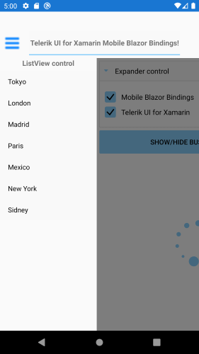

# SideDrawer for Xamarin Mobile Blazor Bindings

**RadSideDrawer for Xamarin Mobile Blazor Bindings** is designed to enable users to visualize a hidden view in their applications. That view can host navigation UI, common settings or any other UI of your choice. It can be visualized using a flick gesture and can be shown from all four sides of the screen.

#### Figure 1: RadSideDrawer Overview

 

## Key features

Below you can find the SideDrawer keyfeatures described:

## Drawer positions

The drawer can be shown from any of the four edges of the screen.  You can define its position through the DrawerLocation property. For more details on this read [Properties]() topic.

RadSideDrawer control exposes the following properties:

* **DrawerContent**: Specifies the drawer (initially hidden) content.
* **MainContent**: Specifies the (initially visible) content of the component.
* **IsOpen** (*bool*): Specifies a value indicating if the drawer content is visible.
* **DrawerLength** (*double*): Defines how much the drawer content should be extended over the main content in opened position.
* **DrawerLocation** (*Telerik.XamarinForms.Primitives.SideDrawer.SideDrawerLocation*): Specifies the location from which the drawer will be opened. The following options are available: 
	* **Left** 
	* **Right**
	* **Top**
	* **Bottom**


* **AreGesturesEnabled** (*bool*): Specifies ability for gestures to open and close the drawer.
* **TouchTargetThreshold** (*double*): Defines the touchable area (number of pixels from the screen edges) that will allow to open the DrawerContent. 

## Effects and transitions

RadSideDrawer supports transition animations that are applied to the opening and closing view. We provide several predefined animations that can be easily set or changed at runtime to meet our customers’ requirements.

The desired transition can be set through `DrawerTransitionType` property of the SideDrawer.

* `DrawerTransitionType` is enumeration of type `Telerik.XamarinForms.Primitives.SideDrawerTransitionType` and exposes the following members:

	* Push (the default one)
	* Fade
	* Reveal
	* ReverseSlideOut
	* ScaleUp
	* SlideAlong
	* SlideInOnTop
	* Custom
	
* **DrawerTransitionDuration** (*double*): Defines the duration of the chosen transition.
* **DrawerTransitionFadeOpacity** (*double*): Defines the opacity of the fade layer of the component. This controls the fade layer opacity on Android or the dim opacity on iOS.

### Example

Here is an example how to set DrawerTransitionType property:

```
<RadSideDrawer DrawerLength="200"
               DrawerTransitionType="Telerik.XamarinForms.Primitives.SideDrawerTransitionType.Push">
				...........
</RadSideDrawer>
```

## See Also

- [Getting Started]()
