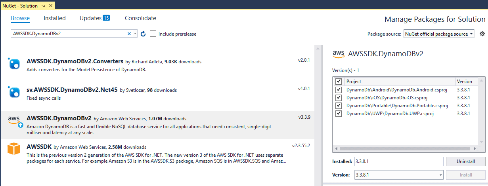
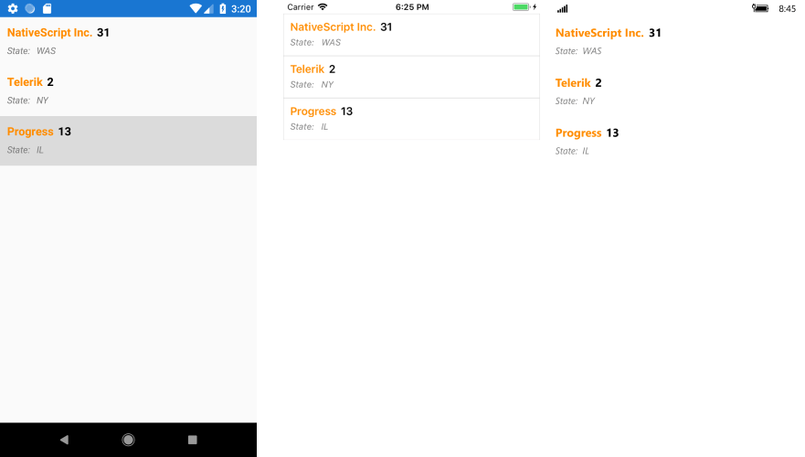

# Dynamo DB

This article will show you how to access data stored in a **DynamoDB** table by connecting to the **AWS DynamoDB** service and visualize the content within a Telerik [RadListView]() element.

> Please note that you can use the [local version](https://docs.aws.amazon.com/amazondynamodb/latest/developerguide/DynamoDBLocal.html) of DynamoDB to setup and test your application. This article shows a real example where an actual DynamoDB web service is used.

## Step 1: Create the Application

Create a new Xamarin.Forms application and add the required assemblies in order to use the controls from the **Telerik UI for Xamarin** suite. For the purpose of the example, we are going to use the [RadListView]() control to show the different items available within our **DynamoDb** instance. 

Here is how the XAML layout is defined in our sample application:

#### __[XAML] Example 1: XAML layout__

	<ContentPage xmlns="http://xamarin.com/schemas/2014/forms"
	             xmlns:x="http://schemas.microsoft.com/winfx/2009/xaml"
	             xmlns:datacontrols="clr-namespace:Telerik.XamarinForms.DataControls;assembly=Telerik.XamarinForms.DataControls"
	             xmlns:telerikListView="clr-namespace:Telerik.XamarinForms.DataControls.ListView;assembly=Telerik.XamarinForms.DataControls"
	             x:Class="DynamoDb.Portable.StartPage">
	    <datacontrols:RadListView x:Name="DataGrid" 
	                              ItemsSource="{Binding Customers}">
	        <datacontrols:RadListView.ItemTemplate>
	            <DataTemplate>
	                <telerikListView:ListViewTemplateCell>
	                    <telerikListView:ListViewTemplateCell.View>
	                        <Grid>
	                            <StackLayout Orientation="Horizontal" Margin="10, 10, 10, 0">
	                                <Label Text="{Binding Name}" FontSize="16" FontAttributes="Bold" TextColor="DarkOrange" VerticalOptions="Center" />
	                                <Label Text="{Binding Id}" FontSize="16" FontAttributes="Bold" TextColor="Black" VerticalOptions="Center" />
	                            </StackLayout>
	                            <StackLayout Orientation="Horizontal" Grid.Row="1" Margin="10, 0, 10, 10">
	                                <Label Text="State: " FontSize="13" FontAttributes="Italic" TextColor="Gray" />
	                                <Label Text="{Binding State}" FontSize="13" FontAttributes="Italic" TextColor="Gray" />
	                            </StackLayout>
	                        </Grid>
	                    </telerikListView:ListViewTemplateCell.View>
	                </telerikListView:ListViewTemplateCell>
	            </DataTemplate>
	        </datacontrols:RadListView.ItemTemplate>
	    </datacontrols:RadListView>
	</ContentPage>

## Step 2: Install the NuGet package

In **Visual Studio** open the **NuGet Package Manager** and install the **DynamoDB** module.

#### Figure 1: Install the DynamoDB package

Another option is to to type the following command in the **NuGet Package Manager Console**: *PM> Install-Package AWSSDK.DynamoDBv2*

>note If you do not have an AWS account in Visual Studio please check the [Getting Started]() article.

## Step 3: Create the ViewModel

As our database contains a list of customers, define a Customer class that will hold the data for a single record.

#### __[C#] Example 2: The Customer class__

    public class Customer
    {
        public int Id { get; set; }

        public string Name { get; set; }

        public int Employees { get; set; }

        public string State { get; set; }
    }

Now add a class called **MainWindowViewModel** to the example. It will handle all the functionality for managing the **DynamoDB** database.

First of all, create the **Customers** collection which will hold the entries from the database and the method that creates the **Customers** table.

#### __[C#] Example 3: Create the Customers table__

    class MainWindowViewModel : NotifyPropertyChangedBase
    {
        private AmazonDynamoDBClient client;
        private ObservableCollection<Customer> customers;
        public MainWindowViewModel()
        {
            try
            {
                this.client = new AmazonDynamoDBClient("your awsAccessKeyId", "your awsSecretAccessKey", RegionEndpoint.USEast1);
                this.Customers = new ObservableCollection<Customer>();
                this.CreateCustomersTable();
                this.AddCustomers();
                this.LoadData(null);
            }
            catch (Exception ex)
            {
                Debug.WriteLine("Error: failed to create a DynamoDB client; " + ex.Message);
            }
        }

        public ObservableCollection<Customer> Customers
        {
            get { return this.customers; }
            set
            {
                if (this.customers != value)
                {
                    this.customers = value;
                    this.OnPropertyChanged("Customers");
                }
            }
        }

        private async void CreateCustomersTable()
        {
            List<string> currentTables = client.ListTablesAsync().Result.TableNames;

            if (!currentTables.Contains("MyCustomers"))
            {
                CreateTableRequest createRequest = new CreateTableRequest
                {
                    TableName = "MyCustomers",
                    AttributeDefinitions = new List<AttributeDefinition>()
                {
                    new AttributeDefinition
                    {
                        AttributeName = "Id",
                        AttributeType = "N"
                    },
                    new AttributeDefinition
                    {
                        AttributeName = "Name",
                        AttributeType = "S"
                    }
                },
                    KeySchema = new List<KeySchemaElement>()
                {
                    new KeySchemaElement
                    {
                        AttributeName = "Id",
                        KeyType = "HASH"
                    },
                    new KeySchemaElement
                    {
                        AttributeName = "Name",
                        KeyType = "RANGE"
                    }
                },
                };

                createRequest.ProvisionedThroughput = new ProvisionedThroughput(1, 1);

                CreateTableResponse createResponse;
                try
                {
                    createResponse = await client.CreateTableAsync(createRequest);
                }
                catch (Exception ex)
                {
                    return;
                }
            }
        }
		. . .

Now that the table is ready you can add some data by implementing the following method inside the **ViewModel**.

#### **[C#] Example 4: Add items to the table**

     private async void AddCustomers()
        {
            var table = Amazon.DynamoDBv2.DocumentModel.Table.LoadTable(client, "MyCustomers");
            var search = table.Scan(new Amazon.DynamoDBv2.DocumentModel.Expression());
            if (search.Count == 0)
            {
                Document dataObj1 = new Document();
                dataObj1["Name"] = "Telerik";
                dataObj1["Id"] = 2;
                dataObj1["Employees"] = 446;
                dataObj1["State"] = "NY";
                await table.PutItemAsync(dataObj1);

                Document dataObj2 = new Document();
                dataObj2["Name"] = "Progress";
                dataObj2["Id"] = 13;
                dataObj2["Employees"] = 1054;
                dataObj2["State"] = "IL";
                await table.PutItemAsync(dataObj2);

                Document dataObj3 = new Document();
                dataObj3["Name"] = "NativeScript Inc.";
                dataObj3["Id"] = 31;
                dataObj3["Employees"] = 109;
                dataObj3["State"] = "WAS";
                await table.PutItemAsync(dataObj3);
            }
        }

You can then invoke the **AddCustomers** method in the constructor of the VieWmodel:

#### **[C#] Example 5: Invoke the AddCustomers method in the viewmodel's constructor**

    	public MainWindowViewModel()
        {
            try
            {
                this.client = new AmazonDynamoDBClient("your awsAccessKeyId", "your awsSecretKeyId", RegionEndpoint.USEast1);
                this.Customers = new ObservableCollection<Customer>();
                this.CreateCustomersTable();
                this.AddCustomers();
                this.LoadData(null);
            }
            catch (Exception ex)
            {
                Debug.WriteLine("Error: failed to create a DynamoDB client; " + ex.Message);
            }
        }

Now set the **DataContext** of the page where the **RadListView** element is hosted to be the **MainWindowViewModel** so that the table is created and the entries are added.

#### **[C#] Example 6: Initialize the MainWindowViewModel**

		public StartPage()
        {
            InitializeComponent();
            this.BindingContext = new MainWindowViewModel();
        }

If you run the code at this point you will be able to see the data in your AWS console.

## Step 4: Get the Data from DynamoDb

Now you are ready to populate the **RadListView** control with the data by iterating over the records in the database and adding items to the Customers collection.

#### **[C#] Example 7: Load data from the database**

    // MainWindowViewModel.cs
    private async void LoadData(object obj)
        {
            var table = Amazon.DynamoDBv2.DocumentModel.Table.LoadTable(client, "MyCustomers");
            var search = table.Scan(new Amazon.DynamoDBv2.DocumentModel.Expression());

            var documentList = new List<Document>();
            do
            {
                documentList.AddRange(await search.GetNextSetAsync());

            } while (!search.IsDone);

            var customers = new ObservableCollection<Customer>();
            foreach (var doc in documentList)
            {
                var customer = new Customer();
                foreach (var attribute in doc.GetAttributeNames())
                {
                    var value = doc[attribute];
                    if (attribute == "Id")
                    {
                        customer.Id = Convert.ToInt32(value.AsPrimitive().Value);
                    }
                    else if (attribute == "Name")
                    {
                        customer.Name = value.AsPrimitive().Value.ToString();
                    }
                    else if (attribute == "Employees")
                    {
                        customer.Employees = Convert.ToInt32(value.AsPrimitive().Value);
                    }
                    else if (attribute == "State")
                    {
                        customer.State = value.AsPrimitive().Value.ToString();
                    }
                }

                customers.Add(customer);
            }

            this.Customers = customers;
        }

If you now call the **LoadData** method in the constructor of the viewmodel, the grid will be populated with the entries from the **AddCustomers** method.

#### Figure 2: The populated RadListView control

## See Also

* [Storage (S3)]()
