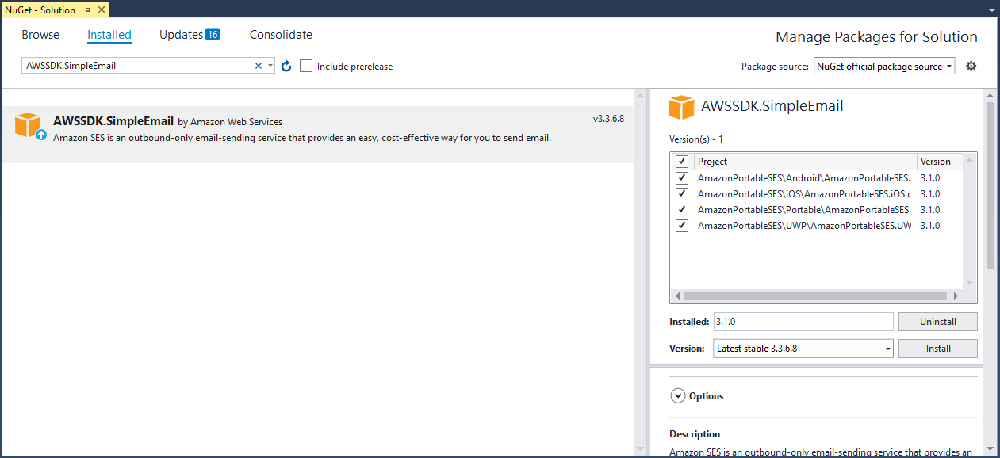
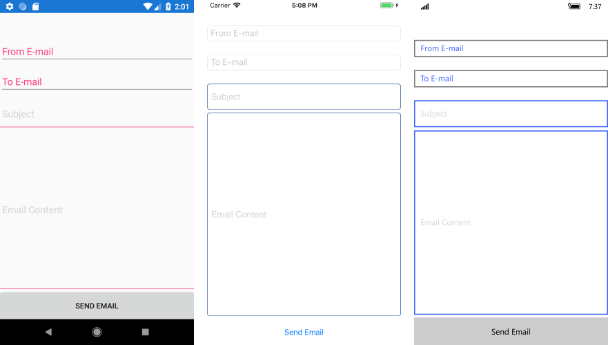

# Simple Email Service

**Amazon SES** is an email service that provides you with a way to send and receive emails using your own email addresses and domains.

This article will demonstrate how one can use this service from a Xamarin application and send an email to a specific address.

## Step 1: Create the Xamarin Application

Create a standard Xamarin application and add several [RadMaskedInput](), [RadEntry]() and [RadButton]() elements to it. The **RadMaskedInput** elements will contain the sender and receiver emails. The subject and the email content will be entered in **RadEntry** elements. The button will be responsible for sending the email.

#### __[XAML] Example 1: Defining the view__

	<ContentPage xmlns="http://xamarin.com/schemas/2014/forms"
             xmlns:x="http://schemas.microsoft.com/winfx/2009/xaml"
             xmlns:local="clr-namespace:AmazonPortableSES.Portable"
             xmlns:telerik="clr-namespace:Telerik.XamarinForms.Input;assembly=Telerik.XamarinForms.Input"
             xmlns:extensions="clr-namespace:Telerik.XamarinForms.Input.MaskedInput;assembly=Telerik.XamarinForms.Input"
             x:Class="AmazonPortableSES.Portable.StartPage">
    <ContentPage.Resources>
        <ResourceDictionary>
            <local:ViewModel x:Key="viewModel"/>
        </ResourceDictionary>
    </ContentPage.Resources>
    <Grid Margin="0,50,0,0">
        <Grid.RowDefinitions>
            <RowDefinition Height="50"/>
            <RowDefinition Height="50"/>
            <RowDefinition Height="50"/>
            <RowDefinition Height="*" />
            <RowDefinition Height="50"/>
        </Grid.RowDefinitions>

        <telerik:RadMaskedInput InputValue="{Binding FromEmail, Source={StaticResource viewModel}, Mode=OneWayToSource}" 
                                MaskType="Regex"
                                InvalidInputErrorText="Invalid Email Address"
                                Mask="{x:Static extensions:MaskExtensions.Email}"  
                                WatermarkText="From E-mail" />

        <telerik:RadMaskedInput InputValue="{Binding ToEmail, Source={StaticResource viewModel}, Mode=OneWayToSource}" 
                                MaskType="Regex"
                                InvalidInputErrorText="Invalid Email Address"
                                Mask="{x:Static extensions:MaskExtensions.Email}"  
                                WatermarkText="To E-mail" 
                                Grid.Row="1"/>
        
        <telerik:RadEntry Text="{Binding Subject, Source={StaticResource viewModel}}"
                          WatermarkText="Subject" 
                          Grid.Row="2" />
        
        <telerik:RadEntry Text="{Binding Content, Source={StaticResource viewModel}}" 
                          WatermarkText="Email Content"
                          Grid.Row="3" />
        
        <telerik:RadButton Command="{Binding SendEmailCommand, Source={StaticResource viewModel}}" Text="Send Email" Grid.Row="4"/>
    </Grid>
	/ContentPage>

## Step 2: Add the SES assemblies

Open the NuGet Package Manager and install the **AWSSDK Simple Email** package.

## Step 3: Define the ViewModel

The Next step is to create the ViewModel. It will need an [IAmazonSimpleEmailService](https://docs.aws.amazon.com/sdkfornet/v3/apidocs/items/SimpleEmail/TISimpleEmailService.html) instance which will be used for sending the emails. We also need to implement the command that the RadButton is bound to.

#### __[C#] Example 2: Defining the ViewModel__

    public class ViewModel
    {
        public ViewModel()
        {
            this.SendEmailCommand = new Command(OnSendEmail);
        }

        public Command SendEmailCommand { get; set; }
        
		public string FromEmail { get; set; }
		public string ToEmail { get; set; }
        public string Subject { get; set; }
        public string Content { get; set; }

        private async void OnSendEmail(object obj)
        {
            using (var client = new AmazonSimpleEmailServiceClient("your awsAccessKeyId", "your awsSecretAccessKey", RegionEndpoint.USEast1))
            {
                var sendRequest = new SendEmailRequest
                {
                    Source = FromEmail,
                    Destination = new Destination { ToAddresses = new List<string> { ToEmail } },
                    Message = new Message
                    {
                        Subject = new Content(this.Subject),
                        Body = new Body { Text = new Content(this.Content) }
                    }
                };
                try
                {
                    Debug.WriteLine("Sending email using AWS SES...");
                    var response = await client.SendEmailAsync(sendRequest);
                    Debug.WriteLine("The email was sent successfully.");
                }
                catch (Exception ex)
                {
                    Debug.WriteLine("The email was not sent.");
                    Debug.WriteLine("Error message: " + ex.Message);
                }
            }
        }
    }

#### Figure 1: Appearance of the application on all three platforms

## Step 4: Add verified email addresses

Before using the application you must verify some email addresses. If you are using the test environment both sender and receiver addresses must be verified. This should be done from the AWS console. You can read the [Verifying an Email Address Using the Amazon SES Console](https://docs.aws.amazon.com/ses/latest/DeveloperGuide/verify-email-addresses-procedure.html#verify-email-addresses-procedure-console) article in order to learn how to do that.

> Please note that the addresses are verified for each region and the regions in the console and the application must be the same. 

After the addresses are added you are ready to test your application. 

# See Also

* [Simple Email Service - Overview](https://docs.aws.amazon.com/ses/latest/DeveloperGuide/Welcome.html)
* [DynamoDB]()