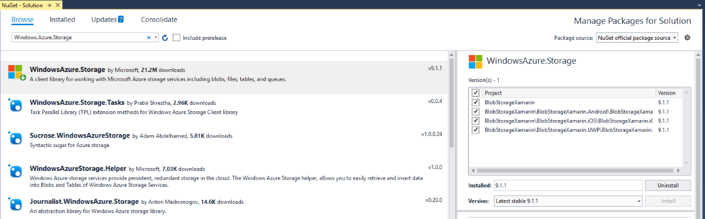

# Blob Storage

Azure Blob storage is a service for storing large amounts of unstructured object data, such as text or binary data, that can be accessed from anywhere in the world via HTTP or HTTPS. You can use Blob storage to expose data publicly to the world, or to store application data privately. This article will demonstrate how one can use this service from a Xamarin application and manage the uploaded files.

## Set up Storage Account

For the purposes of this article, you will have to create an [Azure Blob Storage account](https://docs.microsoft.com/en-us/azure/storage/common/storage-create-storage-account). You can also check the following blog post by Brandon Minnick which explains in details how to set up the service and create a simple Xamarin.Forms application which uses the Azure Blob Storage - [Add Cloud Storage to Xamarin Apps with Azure Blob Storage](https://blog.xamarin.com/xamarin-plus-azure-blob-cloud-storage/).

For the purposes of this sample, we have created a container which contains several photos:

## Create the Xamarin Application

We are going to create a simple Xamarin.Forms application which will contain a **RadSlideView** control which will visualize the different photos stored in the Azure Blob Storage. Here is how the simple page is defined:

	<ContentPage xmlns="http://xamarin.com/schemas/2014/forms"
             xmlns:x="http://schemas.microsoft.com/winfx/2009/xaml"
             xmlns:local="clr-namespace:BlobStorageXamarin"
             xmlns:telerikPrimitives="clr-namespace:Telerik.XamarinForms.Primitives;assembly=Telerik.XamarinForms.Primitives"
             x:Class="BlobStorageXamarin.MainPage">

    <telerikPrimitives:RadSlideView x:Name="slideView" 
                                    ItemsSource="{Binding PhotoSource}">
        <telerikPrimitives:RadSlideView.ItemTemplate>
            <DataTemplate>
                <ContentView>
                    <Grid Margin="20">
                        <Grid.RowDefinitions>
                            <RowDefinition Height="50"/>
                            <RowDefinition/>
                        </Grid.RowDefinitions>
                        <Label Text="{Binding Title}" 
                               TextColor="DarkOrange" 
                               FontSize="25"
                               VerticalTextAlignment="Center"
                               HorizontalTextAlignment="Center"/>
                        <Image Source="{Binding Uri}" 
                               Grid.Row="1"></Image> 
                    </Grid>
                </ContentView>
            </DataTemplate>
        </telerikPrimitives:RadSlideView.ItemTemplate>
    </telerikPrimitives:RadSlideView>
	</ContentPage>

## Install the NuGet package

As a next step, open the NuGet Package Manager and install the **WindowsAzure.Storage** package.

## Set up the BlobStorage Service

We are going to reuse the **BlobStorageService** class from the previously referenced blog post. Here is its exact implementation:

	public class BlobStorageService
    {

        readonly static CloudStorageAccount _cloudStorageAccount = CloudStorageAccount.Parse("DefaultEndpointsProtocol=https;AccountName=telerikcloud;AccountKey=HBZSJxUwRkX5eGq2au8w3G1SJiIBCZeCyOG6YQ6PfrolBid9K+sqHhE8hYF7MVI+x2/uEl88abpGZMWsYkqFzg==;EndpointSuffix=core.windows.net");
        readonly static CloudBlobClient _blobClient = _cloudStorageAccount.CreateCloudBlobClient();

        public static async Task<List<T>> GetBlobs<T>(string containerName, string prefix = "", int? maxresultsPerQuery = null, BlobListingDetails blobListingDetails = BlobListingDetails.None) where T : ICloudBlob
        {
            var blobContainer = _blobClient.GetContainerReference(containerName);

            var blobList = new List<T>();
            BlobContinuationToken continuationToken = null;

            try
            {
                do
                {
                    var response = await blobContainer.ListBlobsSegmentedAsync(prefix, true, blobListingDetails, maxresultsPerQuery, continuationToken, null, null);
                    continuationToken = response?.ContinuationToken;
                    foreach (var blob in response?.Results?.OfType<T>())
                    {
                        blobList.Add(blob);
                    }
                } while (continuationToken != null);
            }
            catch (Exception e)
            {
                //Handle Exception
            }
            return blobList;
        }

        public static async Task<CloudBlockBlob> SaveBlockBlob(string containerName, byte[] blob, string blobTitle)
        {
            var blobContainer = _blobClient.GetContainerReference(containerName);
            var blockBlob = blobContainer.GetBlockBlobReference(blobTitle);
            await blockBlob.UploadFromByteArrayAsync(blob, 0, blob.Length);
            return blockBlob;
        }
    }

And the **PhotoModel** class which is a representation of each photo within the photos container:

	public class PhotoModel
    {
        public System.Uri Uri { get; set; }
        public string Title { get; set; }
    }

Now that we have the core logic of extracting the photos from the container and loading them in the application's memory, we can set the generated collection as an **ItemsSource** of the **RadSlideView** control. We have done this in the code-behind of the page:

	public partial class MainPage : ContentPage
	{
        public ObservableCollection<PhotoModel> PhotoSource { get; set; } 
        readonly ActivityIndicator _activityIndicator = new ActivityIndicator();
        public MainPage()
		{
            InitializeComponent();
            this.PhotoSource = new ObservableCollection<PhotoModel>();
            this.slideView.BindingContext = this;
            Title = "Image Page";
        }

        protected override async void OnAppearing()
        {
            base.OnAppearing();
            _activityIndicator.IsRunning = true;

            var blobList = await BlobStorageService.GetBlobs<CloudBlockBlob>("photos");

            foreach (var blob in blobList)
            {
                var photo = new PhotoModel { Title = blob?.Name, Uri = blob?.Uri };
                PhotoSource.Add(photo);
            }

            _activityIndicator.IsRunning = false;
            _activityIndicator.IsVisible = false;
        }
    }

Here is the resulting view in Android:

## See Also
