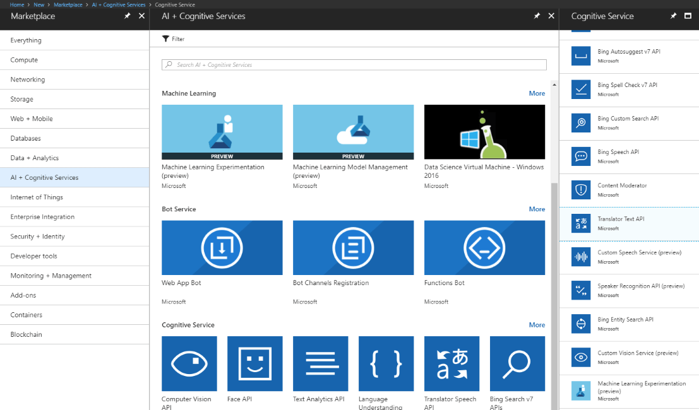
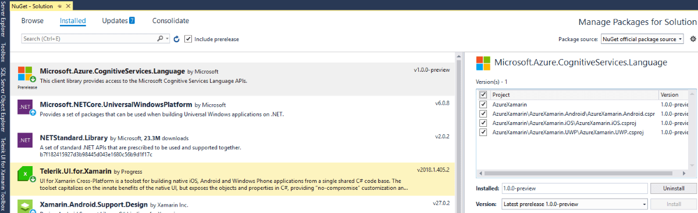
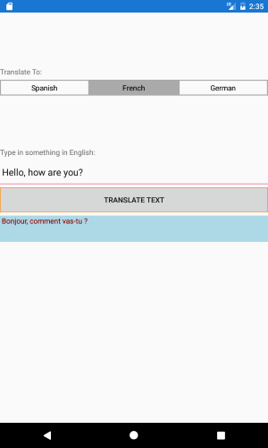

# Text Translation 

&nbsp;

This article will guide you through the process of integrating Azure's [Translator Text API](https://docs.microsoft.com/en-us/azure/cognitive-services/translator/) with the controls from the **Telerik UI for Xamarin** suite.

## Create a Bing Speech API Account

Before you start, you need to create a new Translation Text API account through the Azure portal. This has been explained in great detail in [this article](https://docs.microsoft.com/en-us/azure/cognitive-services/cognitive-services-apis-create-account).

Once you've created the account, you have to obtain the subscription keys that have been generated for you. You will require them later on in order to make API calls from your application.

## Create the Application

Once we have activated the service, we can proceed with creating a simple Xamarin.Forms application. We are going to use the following view in order to utilize the translation service:

	<ContentPage xmlns="http://xamarin.com/schemas/2014/forms"
             xmlns:x="http://schemas.microsoft.com/winfx/2009/xaml"
             xmlns:telerikListView="clr-namespace:Telerik.XamarinForms.DataControls;assembly=Telerik.XamarinForms.DataControls"
             xmlns:telerikInput="clr-namespace:Telerik.XamarinForms.Input;assembly=Telerik.XamarinForms.Input"
             x:Class="AzureXamarin.TranslatorAPI.TranslatorAPIpage">
    <ContentPage.Content>
        <Grid>
            <Grid.RowDefinitions>
                <RowDefinition Height="200"/>
                <RowDefinition/>
            </Grid.RowDefinitions>
            <Grid Grid.Row="0">
                <Grid.RowDefinitions>
                    <RowDefinition/>
                    <RowDefinition/>
                </Grid.RowDefinitions>
                <StackLayout  Grid.Row="1">
                    <Label Text="Translate To:"/>
                    <telerikInput:RadSegmentedControl x:Name="segmentedControl2" SelectedIndex="1">
                        <telerikInput:RadSegmentedControl.ItemsSource>
                            <x:Array Type="{x:Type x:String}">
                                <x:String>English</x:String>
                                <x:String>French</x:String>
                                <x:String>German</x:String>
                            </x:Array>
                        </telerikInput:RadSegmentedControl.ItemsSource>
                    </telerikInput:RadSegmentedControl>
                </StackLayout>
            </Grid>
            <StackLayout Margin="0,50,0,0" Grid.Row="1">
                <Label Text="Type in something in English: "></Label>
                <telerikInput:RadEntry x:Name="entry" 
                                       WatermarkText="Text to be translated..."/>
                <telerikInput:RadButton x:Name="btn" 
                                        BorderRadius="5"
                                        BorderThickness="2"
                                        BorderColor="DarkOrange"
                                        Text="Translate Text" 
                                        Clicked="Btn_Clicked"/>
                <Label x:Name="resultLabel" 
                       TextColor="DarkRed"
                       BackgroundColor="LightBlue"
                       HeightRequest="50"/>
            </StackLayout>
        </Grid>
    </ContentPage.Content>
	</ContentPage>	

## Add the Azure Language NuGet Package

You now have to add the **Microsoft.Azure.CognitiveServices.Language** NuGet package.

## Use the Text Translation API

Now that we have set up the application and have created the required UI, we need to send a REST request to the Text Translation API. It should include the text(extracted from the **RadEntry**) and the language in which the text should be translated(chosen through the **RadSegmented** control):

	public partial class TranslatorAPIpage : ContentPage
	{
        
        static string key = "your unique key";
        static string host = "https://api.microsofttranslator.com";
        static string path = "/V2/Http.svc/Translate";

        public TranslatorAPIpage ()
		{
			InitializeComponent ();
        }

        private void Btn_Clicked(object sender, EventArgs e)
        {
            TranslateTextAsync(this.resultLabel);
        }

        public async void TranslateTextAsync(Label label)
        {
            HttpClient client = new HttpClient();
            client.DefaultRequestHeaders.Add("Ocp-Apim-Subscription-Key", key);
           
            string translateToLanguage = (this.segmentedControl2.ItemsSource as string[])[this.segmentedControl2.SelectedIndex];
            string textToTranslate = this.entry.Text;

            string languageCode =  CheckLanguageCode(translateToLanguage);

            if (!translateToLanguage.Equals(String.Empty))
            {
                string uri = host + path + "?to=" + languageCode + "&text=" + System.Net.WebUtility.UrlEncode(textToTranslate);
                HttpResponseMessage response = await client.GetAsync(uri);
                string result = await response.Content.ReadAsStringAsync();
                var content = XElement.Parse(result).Value;
                label.Text = " " + content;
            }
        }

        private string CheckLanguageCode(string translateToLanguage)
        {
            switch (translateToLanguage)
            {
                case "Spanish":
                    return "es-es";
                case "French":
                    return "fr-fr";
                case "German":
                    return "de-de";
                default:
                    return "en-en";
            }
        }
    }

Now that you have everything set correctly, try typing something in English and chose the language to which it will be translated from the **RadSedmented** control's options. Here is the appearance of the view:

## See Also

* [Text Analysis]()
* [Blob Storage]()
* [SQL Database]() 
* [Cosmos DB]()
