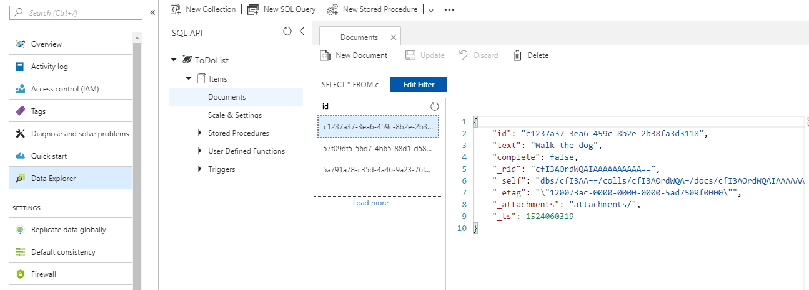
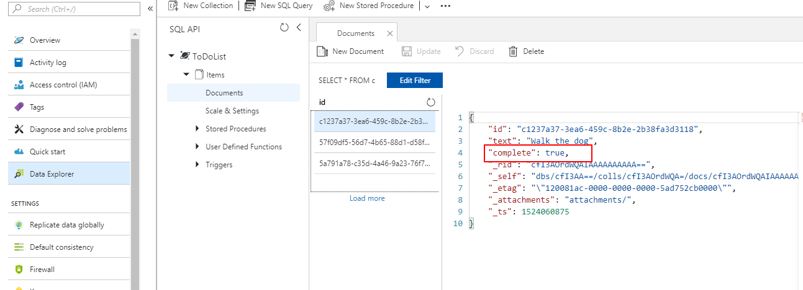

# Integration between Cosmos DB and RadListView

&nbsp;

**Azure Cosmos DB** is a globally distributed, multi-model database service which enables you to develop document, key-value, wide-column, and graph databases by using popular APIs and programming models. This article will show you how to integrate the RadGridView control to work with your remote database.

## Set Up the Database

Let's start with setting up the Cosmos Db database. Microsoft Azure's documentation is pretty detailed and shows how to achieve this step-by-step. You can review the following  guide in order to set up your database - [Create a database account](https://docs.microsoft.com/en-us/azure/cosmos-db/create-sql-api-dotnet#create-a-database-account)

## Download the Default Demo Application

Once you have successfully created the database account, you can directly download a Xamarin application which will be populated with the required information and you won't need to manually add all the needed settings. Simply explore the sample project in order to find out how to set up your actual application.

You should also [Add a collection](https://docs.microsoft.com/en-us/azure/cosmos-db/create-sql-api-dotnet#add-a-collection) which is again explained in details in the step-by-step guide. 

## Modify the Default Xamarin Application

As you have noted if you have followed the guide provided by Microsoft, the example used there is within a Web application. We have decided to use the functionality in a Xamarin one, so we have to download a Xamarin test application. Here is where you can achieve this:

By default, the downloaded sample contains a **ListView** which represents all of the incomplete tasks from the database. We are going to replace the default **ListView** element with a [RadListView]() so we can take advantage of its additional features and functionalities. So here is the XAML which we are going to use:

	<ContentPage xmlns="http://xamarin.com/schemas/2014/forms" 
             xmlns:x="http://schemas.microsoft.com/winfx/2009/xaml" 
             xmlns:local="clr-namespace:DocumentDBTodo" 
             x:Class="DocumentDBTodo.DocumentDBTodoPage"
             xmlns:telerikListView="clr-namespace:Telerik.XamarinForms.DataControls.ListView;assembly=Telerik.XamarinForms.DataControls"
             xmlns:telerikDataControls="clr-namespace:Telerik.XamarinForms.DataControls;assembly=Telerik.XamarinForms.DataControls">
    <Grid RowSpacing="0">
        <Grid.RowDefinitions>
            <RowDefinition Height="Auto" />
            <RowDefinition Height="*" />
        </Grid.RowDefinitions>
        <ActivityIndicator Grid.RowSpan="2"
                       HorizontalOptions="Center"
                       VerticalOptions="Center"
                       IsVisible="False"
                       IsEnabled="True"
                       x:Name="syncIndicator"/>
        <StackLayout Grid.Row="0" BackgroundColor="#5ABAFF" Padding="10,30,10,5">
            <Label TextColor="#555555" Text="Azure DocumentDB" />
            <Grid>
                <Grid.ColumnDefinitions>
                    <ColumnDefinition/>
                    <ColumnDefinition Width="Auto"/>
                </Grid.ColumnDefinitions>
                <Entry x:Name="newItemName"
                  Placeholder="Item name" />
                <StackLayout x:Name="buttonsPanel" Grid.Column="1" Orientation="Horizontal" HorizontalOptions="StartAndExpand">
                    <Button Text="+"
                  MinimumHeightRequest="30"
                  Clicked="OnAdd" />
                </StackLayout>
            </Grid>
        </StackLayout>
        <telerikDataControls:RadListView x:Name="todoList"
                                         IsPullToRefreshEnabled="True"
                                         RefreshRequested="todoList_RefreshRequested"
                                         IsItemSwipeEnabled="True"
                                         SwipeOffset="120, 0, 0, 0"
                                         SwipeThreshold="120"
                                         Grid.Row="1">
            
            <telerikDataControls:RadListView.ItemSwipeContentTemplate>
                <DataTemplate>
                    <Grid Margin="0"
                          Padding="0"
                          ColumnSpacing="0"
                          RowSpacing="0">
                        <Grid.ColumnDefinitions>
                            <ColumnDefinition Width="120" />
                            <ColumnDefinition Width="*" />
                        </Grid.ColumnDefinitions>
                        <Button Margin="0"
                                BackgroundColor="Red"
                                BorderRadius="0"
                                Clicked="OnComplete"
                                CommandParameter="{Binding .}"
                                Text="Complete"
                                WidthRequest="70" />
                    </Grid>
                </DataTemplate>
            </telerikDataControls:RadListView.ItemSwipeContentTemplate>
            
            <telerikDataControls:RadListView.ItemTemplate>
                <DataTemplate>
                    <telerikListView:ListViewTemplateCell>
                        <telerikListView:ListViewTemplateCell.View>
                            <Grid BackgroundColor="Orange">
                                <Label Margin="10" Text="{Binding Text}" TextColor="Gray" />
                            </Grid>
                        </telerikListView:ListViewTemplateCell.View>
                    </telerikListView:ListViewTemplateCell>
                </DataTemplate>
            </telerikDataControls:RadListView.ItemTemplate>
        </telerikDataControls:RadListView>
    </Grid>
	</ContentPage>

The newItemName **Entry** is used for choosing a name for the item which we are going to add. By clicking the **Button** we are going to add this item to our database:

		async Task AddItem (TodoItem item)
		{
			await manager.InsertItemAsync (item);
			todoList.ItemsSource = await manager.GetTodoItemsAsync ();
		}

The **TodoItem** and **TodoItemManager** classes are kept the same as well. We are also going to reuse the async methods for querying the database and adding new items to it. So basically, we just need to make sure that the **RadListView** component gets the correct items. Here is the async method that is responsible for this:

	private async Task RefreshItems (bool showActivityIndicator)
		{
			using (var scope = new ActivityIndicatorScope (syncIndicator, showActivityIndicator)) {
				todoList.ItemsSource = await manager.GetTodoItemsAsync ();
			}
		}

And its actual implementation in the **TodoItemManager** class:

	public async Task<List<TodoItem>> GetTodoItemsAsync ()
		{
			try {
				// The query excludes completed TodoItems
				var query = client.CreateDocumentQuery<TodoItem> (collectionLink, new FeedOptions { MaxItemCount = -1 })
					  .Where (todoItem => todoItem.Complete == false)
					  .AsDocumentQuery ();

				Items = new List<TodoItem> ();
				while (query.HasMoreResults) {
					Items.AddRange (await query.ExecuteNextAsync<TodoItem> ());
				}

			} catch (Exception e) {
				Console.Error.WriteLine (@"ERROR {0}", e.Message);
				return null;
			}

			return Items;
		}

> Note that the Microsoft.Azure.DocumentDB.Core package is installed for the project in order to use this functionality

Here is the appearance of the **RadListView** in Android after we have added several items in our database:

If you have a look at the Data Explorer in Azure's portal, you will notice that the items are correctly added:

We have defined the **RadListView** so that an item is marked as complete by clicking the button within its custom Swipe ItemTemplate:

After the updates, you can notice that the individual item marked as complete is updated as well:

You can investigate the other methods in the **TodotItemManager** and consider taking such approach in your application as well.

## See Also

* [Blob Storage]()
* [SQL Database]() 
* [Text Analysis]({slug cloud-integration-cognitive-services-text-analysis%})
