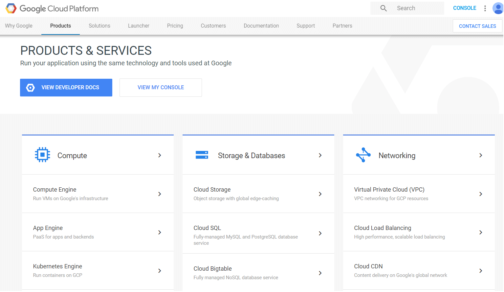

## Google Cloud Overview

Google Cloud Platform is a solution which allows businesses to leverage Google's infrastructure. The platform provides different services similar to those of the other most famous and widely-used providers such as Microsoft and Amazon. This section aims to provide an overview of some of the available services and show simple scenarios on how the platform can be integrated with the **Telerik UI for Xamarin** controls.

>note Only few of the available services that Google Cloud Platform provides are listed here. For more detailed information and resources, please visit Google Cloud Platform's product page.

Here is a short list of some of the most useful services:

- **Computing**: Google Compute Enginge Google Compute Engine is an Infrastructure-as-a-Service product offering flexible, self-managed virtual machines hosted on Google's infrastructure. Google Compute Engine includes Linux and Windows based virtual machines running on KVM, local and durable storage options, and a simple REST based API for configuration and control. The service integrates with Cloud platform technologies such as Google Cloud Storage, Google App Engine, and Google BigQuery to extend beyond the basic computational capability to create more complex and sophisticated applications[rework]

- **Storage & Databases**: Google Cloud Platform offers object storage for different needs and price points as well as managed MySQL and globally-scalable NoSQL databases. Some of the storage/databases solutions that Google Cloud provides are Cloud SQL, Google Cloud Storage, Cloud DataStore.[rework]

- **Cloud AI**: Google Cloud's AI provides modern machine learning services, with pre-trained models and a service to generate your own tailored models. Some of the products within this section are Speech Recognition API, Image Analysis API, Text Analysis API, etc.
[rework]

!! Description is almost the same as the one from the official google docs!!

## See Also

- [Google Cloud Functions]()
- [Google Cloud Translation API]()
- [Google Cloud MySQL DataBase]()