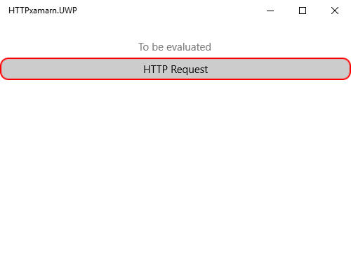
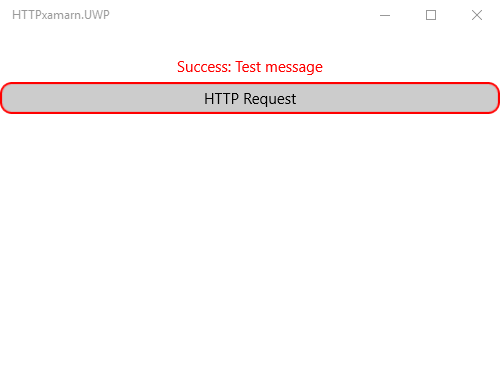

## Cloud Functions

By utilizing Google Cloud Functions, you can focus on building up your application and the logic it requires without the need to take care of your own infrastructure. Through this service you can design and create functions which are straight-forward and simple.They can be related to your other cloud services/infrastructure and the events associated with them.  

As stated in the Google's [official documentation](https://cloud.google.com/functions/docs/writing/http): "HTTP Functions are used when you want to directly invoke your function via HTTP(S). To allow for specific HTTP semantics, the signature of an HTTP function takes HTTP-specific arguments: request and response."

The sample below shows how invoke a simple HTTP function through a Xamarin.Forms Application. In order to set up a simple HTTP function, you can check the following how-to article - [HTTP Functions Sample Usage](https://cloud.google.com/functions/docs/writing/http).

>note Google Cloud Functions are written in JavaScript, and execute in a Node.js runtime.

The function we are going to use is the one shown in the 'Sample usage' section of Google Cloud Platform's documentation which is referenced at the beginning of this page. Here is how it is declared:

	exports.helloWorld = (req, res) => {
		if (req.body.message === undefined) {
    		// This is an error case, as "message" is required
    	res.status(400).send('No message defined!');
	} else {
	    // Everything is ok
	    console.log(req.body.message);
	    res.status(200).end();
    }

It responds to any HTTP request that can provide a "message" field in its body.

Let's say we want to invoke the function on a button click within our application. We are going to use the  **System.Net.Http.HttpClient** API for these purposes. 

	 public class ViewModel
 	   {
        public const string URI = "[your function URI address]";
        static  HttpClient client = new HttpClient();
        
        public async Task<string> GetResponseString(string text)
        {
            var httpClient = new HttpClient();

            var parameters = new Dictionary<string, string>();
            parameters["message"] = text;

            var response = await httpClient.PostAsync(URI, new FormUrlEncodedContent(parameters));
            var contents = await response.Content.ReadAsStringAsync();

            return contents;
        }
    }

For the sample purposes, the method that calls the function is used within the click event handler of a **RadButton**. The string returned from the function is used as the Text of a Label:

	private async void RadButtonClicked(object sender, EventArgs e)
        {
            var vm = new ViewModel();
            string message = await vm.GetResponseString("Test message");
            this.label.Text = message;
        }

Here is the appearance of the Label before the function is called:

And here is an image with the results after calling the function in an UWP application:

## See Also

- [Google Cloud Overview]()
- [Google Cloud Translation API]()
- [Google Cloud MySQL DataBase]()