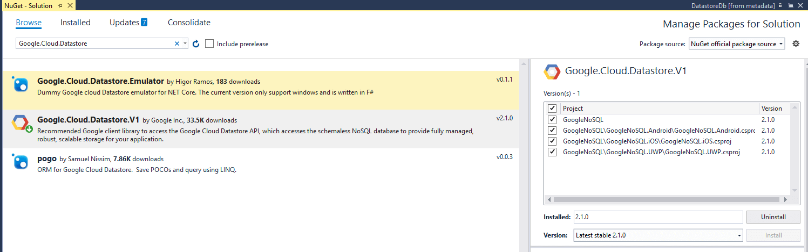

# Google Cloud Datastore(NoSQL database)

Cloud Datastore is a highly-scalable NoSQL database which Google promotes for scenarios that require high-availabilty and durability, and is capable of multiple features such as ACID transactions, SQL-like queries, indexes and many more. This in combination with the characteristic for the NoSQL database solutions of being able to handle different data types, great scalability and the great performance makes it a choice you should have in mind when considering the architecture of your application. 

#### Figure 1: Datastore service management page in Google Cloud Console

>You can find more detailed information regarding the **Cloud Datastore** product on its [official documentation page](https://cloud.google.com/datastore/docs/)

The purpose of this article is to familiarize you with the .NET API designed for the product and show you how you can manipulate the database - add, delete items from it. For the purposes we have already created a very simple database with several "Book" object as shown in the picture.

## Prerequisites

You can check the following tutorial on how to set up your **Datastore** instance - [Datastore Quickstart](https://cloud.google.com/datastore/docs/quickstart). 

## Usage

In order to use the classes needed for manipulating the database, you need to install the Google.Cloud.DataStore.V1 NuGet package. It can be found on Nuget's official package source server. **Figure 2** shows how the package can be found and installed for the different projects within your **Xamarin.Forms** application.

#### Figure 2: Google.Cloud.Datastore.V1 NuGet Package

Once you have the library installed, modifying the database is very straightforward. Here is how you set up a connection to your NoSql database:

		DatastoreDb db;
        public MainPage()
        {
            InitializeComponent();

            string projectId = "my-project-1519048207138";
            db = DatastoreDb.Create(projectId);
        }

As a first step, we are going to query the database so that we obtain a list of the desired items. For the purpose of this example, we will get all the book objects whose category is "Science Fiction" through the following method.

	internal Query GetEntities()
	{
		Query query = new Query("Book")
		{
	    	Filter = Filter.Equal("Category", "Science Fiction"))
		};
		return query;
	}

We are going to use the following class which represents the Book entity from the database:

	public class Book
    {
        public long Key { get; set; }
        public string Name { get; set; }
        public string Author { get; set; }
        public string Category { get; set; }
        public DateTime DateIssued { get; set; }
        public int Size { get; set; }
    }

### Listing the entities present in the Database

The **RadListView** or **RadDataGrid** are generally a great choice to represent a list of similar objects. For the purpose of this example we are going to use the **RadListView**. Here comes in use the query, example of which was previously shown:

		internal List<Book> GetBooks()
        {
            List<Book> books = new List<Book>();
           
            DatastoreQueryResults tasks = db.RunQuery(GetEntities());

            foreach (var entity in tasks.Entities)
            {
                Book book = new Book();
                book.Author = (string)entity["Author"];
                book.Name = (string)entity["Name"];
                book.Size = (int)entity["Size"];
                book.Author = (string)entity["Author"];
                books.Add(book);
            }
            return books;
        }

Setting this list as the ItemsSource of the RadListView results in the following appearance:

-> Picture of RadListView or RadDataGrid that has this ItemsSource

### Inserting an entity to the NoSQL database

In order to insert a new object to the database, you should use the DatastoreTransaction's **BeginTransaction** method. Let's fill in the book's properties in our Xamarin.Forms application through the **RadDataForm** which is a perfect choice for modifying the properties of a single item. Here is how the **RadDataForm** is defined:

[RADDATAFORM DEFINITION] -> You can choose what control to use...

Once we have filled the necessary fields, you can use the following approach to send the new object to the cloud:

/*--modify the database by using the info from the RadDataForm instead of the hard-coded one--*/

	internal void InsertBook()
        {
			Book newBook = this.form.CurrentItem as Book;

            // The kind for the new entity
            string kind = "Book";
            // The name/ID for the new entity
            string name = "samplebook1";

            KeyFactory keyFactory = db.CreateKeyFactory(kind);
            // The Cloud Datastore key for the new entity
            Key key = keyFactory.CreateKey(name);

            var task = new Entity
            {
                Key = key,
                ["Author"] = newBook.Author,
                ["Category"] = newBook.Category,
                ["Date issued"] = newBook.DateIssued.ToUniversalTime(),
                ["Size"] = newBook.Size,
				["Name"] = newBook.Name
            };
            using (DatastoreTransaction transaction = db.BeginTransaction())
            {
                // Saves the task
                transaction.Upsert(task);
                transaction.Commit();
            }
        }

### Deleting an Entity from the NoSQL database

Once again, deleting an entity from the database is very straightforward. You can directly work with the **DatastoreDb** instance and call its **Delete** method by passing a certain **Entity** object which should be removed.

	 DatastoreQueryResults tasks = db.RunQuery(GetEntities());
	 Entity itemToDelete = tasks.Entities.FirstOrDefault();
	 if (itemToDelete  != null)
	 {
	 	 db.Delete(itemToDelete);
	 }

## See Also

- [Google Cloud Overview]()
- [Google Cloud Functions]()
- [Google Cloud Translation API]()