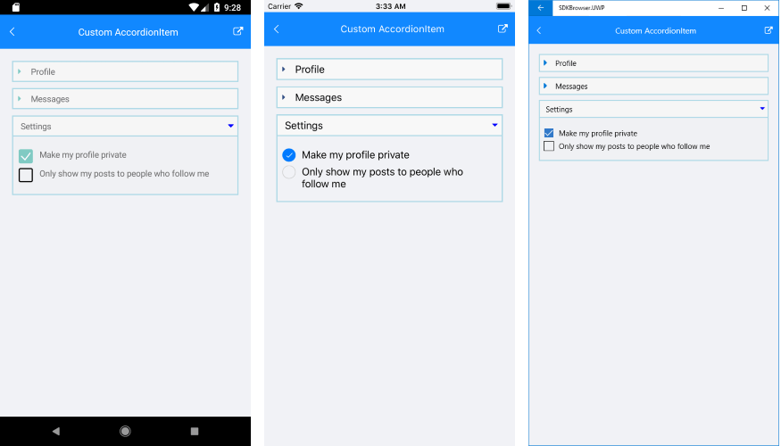

# AccordionItem control

## Basic Features

#### AccordionItem Header

You could either apply HeaderText property or use the AccordionItemHeader content control which provides a set of useful properties for customizing the look & feel of the Header.  For more details refer to [AccordionItemHeader](#accordionitemheader) section.

#### IsExpanded
	
IsExpanded is a Boolean property to indicate the currently expanded state of the AccordionItem.	
	
#### Border Styles

You could utilize BorderColor and BorderThickness properties of RadAccordionItem to change the way the Border around the control looks.

## AccordionItemHeader

The indicator is the little triangle that is rotated according to whether the AccordionItem control is expanded or collapsed. AccordionItemHeader provides various options for customizing the look of the indicator via the following properties:

* **IndicatorText**: The indicator is represented by a string symbol that could be changed through IndicatorText property;
* **IndicatorFontFamily**: Specifies the indicator text FontFamily;
* **IndicatorFontSize**: Defines the indicator text font size;
* **IndicatorColor**: This property sets the color of the indicator;
* **IndicatorLocation**: This property is of type *ExpandCollapseIndicatorLocation* and is used to place the indicator to the left or to the right inside the Header;
* **IndicatorAnimationDuration**: Specifies the duration of the rotation animation of the indicator;
* **IndicatorAnimationEasing**: Specifies the easing of the rotation animation of the indicator;
* **IndicatorMargin**: This property is of type *Thickness* and sets the margin applied to the indicator;

You could apply **BorderColor** and **BorderThickness** properties of AccordionItemHeader to make it consistent with the design of your app. 

The following snippet shows the AccordionItemHeader could be customized:

<snippet id='accordion-features-accordionitem' />

Next image displays how RadAccordion will look with thus defined items:



The following snippet shows how to set Font Options to the AccordionItemHeader Text:

```XAML
<telerikPrimitives:AccordionItem BorderColor="LightBlue"
                                 BorderThickness="2">
    <telerikPrimitives:AccordionItem.Header>
        <telerikPrimitives:AccordionItemHeader>
            <Label Text="Profile"
                   Margin="0,8"
                   FontSize="25"
                   FontAttributes="Bold"/>
        </telerikPrimitives:AccordionItemHeader>
    </telerikPrimitives:AccordionItem.Header>
    <telerikPrimitives:AccordionItem.Content>
        <Label Text="John Smith" Margin="8" />
    </telerikPrimitives:AccordionItem.Content>
</telerikPrimitives:AccordionItem>
```

>important A sample Accordion Item example can be found in the Accordion/Features folder of the [SDK Samples Browser application]().

## See Also

- [Key Features]()
