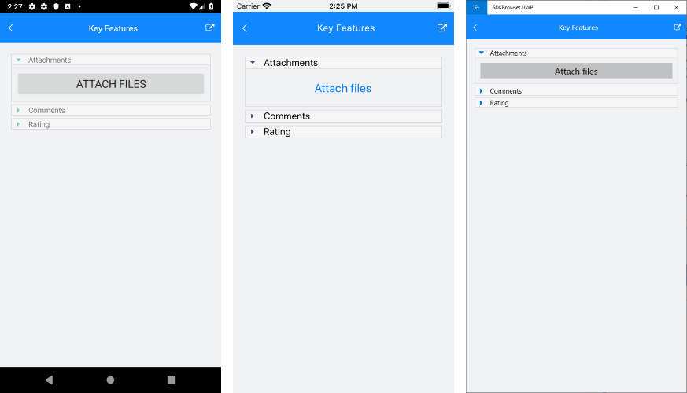
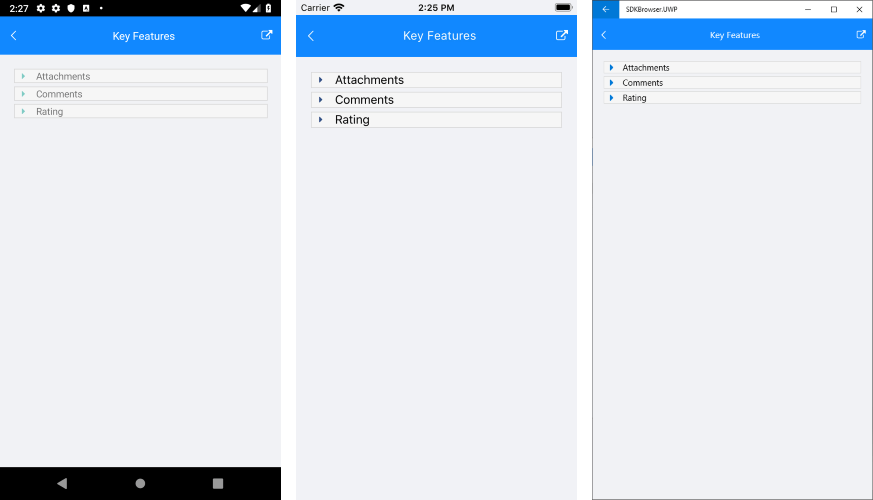

# Key Features

The purpose of this help article is to show you the key features of the **RadAccordion** control. 

## Collapsed/expanded States

In the Accordion control each item provides a header that expands when clicked, showing more information. The control is designed in such a way that opening one AccordionItem automatically closes the previously displayed content. 

There can be only one expanded item at a time indicated by **IsExpanded** property of the [AccordionItem]() object.

## Collapse All Items

Through **CanCollapseAllItems** boolean property you can allow users to fully collapse the Accordion items. If **CanCollapseAllItems** is enabled, clicking on the header of an expanded Accordion item will collapse it.

>note The option for collapsing all items is available with R1 2020 release of Telerik UI for Xamarin.

## Animation while expanding/collapsing

To enable or disable the animation you need to use the **IsAnimationEnabled** property of RadAccordion. By default, the Animation is enabled.

You could also customize the duration and easing through **AnimationDuration** and **AnimationEasing** properties.

* **AnimationDuration** (*int*): Defines the duration of the animation while expanding/collapsing the AccordionItem. The default value is 500.
* **AnimationEasing** (*Xamarin.Forms.Easing*): Specifies animation acceleration over time. The default value is Easing.Linear.

## Spacing between items

Through **Spacing**(double) property you could specify the distance between the Accordion items. The default value is 0.

## Example

The snippet below shows how the **CanCollapseAllItems**, **AnimationDuration**, **AnimationEasing** and **Spacing** properties can be applied:

<snippet id='accordion-key-features-xaml'/>

In addition to this, you need to add the following namespace:

```XAML
xmlns:telerikBusyIndicator="clr-namespace:Telerik.XamarinForms.Primitives;assembly=Telerik.XamarinForms.Primitives"
xmlns:telerikInput="clr-namespace:Telerik.XamarinForms.Input;assembly=Telerik.XamarinForms.Input"
```
```C#
using Telerik.XamarinForms.Primitives;
using Telerik.XamarinForms.Input;
```

The image below shows the result after running the snippet:



And the Accordion when all items are collapsed:



>important A sample Key Features example can be found in the Accordion/Features folder of the [SDK Samples Browser application](#sdk-browser-application).

## See Also

- [AccordionItem Control]()
