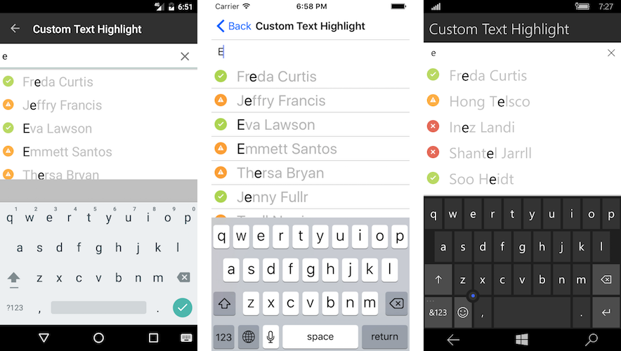

# Overview #

The **RadAutoComplete for Xamarin.Forms** can automatically complete user input string by comparing the text being entered to all strings in the associated data source. The control provides means for easy customization and data management.

> **RadAutoComplete** is available for the following platforms:
> 
> - **Android**
> - **iOS**
> - **Windows 8.1**
> - **Windows Phone 8.1**
> - **Universal Windows Platform**

