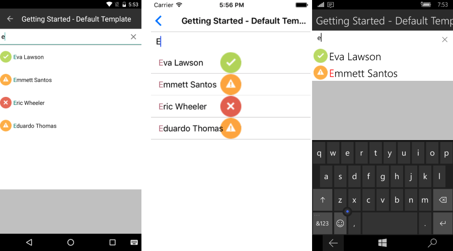

# Bindig

For all cases where the business items are not simple strings data-binding is necessary in order to correctly visualize information. Such kind of binding is supported by the **RadAutoComplete** component in the form of path properties.

### TextSearchPath

>This property is required to be set in all data-binding scenarios!

- **TextSearchPath** (string): Gets or sets the name of the property the search function will be executed against.

Setting this property will force the **RadAutoComplete** component to use a default template for visualizing the suggestion items. This template consist of one Label with default visualization. The default templates cannot be changed. If customizations are required users can refer to SuggestionItemTempalte article.

#### Example

##### Defining Business Object

<snippet id='autocomplete-data-binding-business-object'/>

##### Creating ViewModel

<snippet id='autocomplete-viewmodel'/>

##### Defining RadAutoComplete

<snippet id='autocomplete-data-binding-xaml'/>
<snippet id='autocomplete-data-binding-codebehind'/>

### ImagePath

This property is optional. It can be used to skip defining custom SuggestionItemTemplate.

- **ImagePath** (string): Gets or sets the name of the property holding a path to an image.

#### Example

<snippet id='autocomplete-default-suggestion-item-template'/>
<snippet id='autocomplete-data-binding-codebehind'/>

Here is how the default template looks in the different platforms:

# See Also

- [SuggestionItem Template]()
