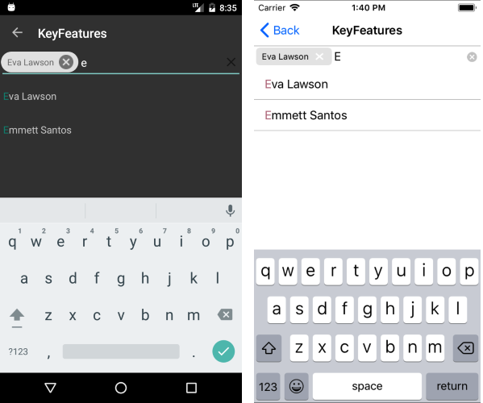
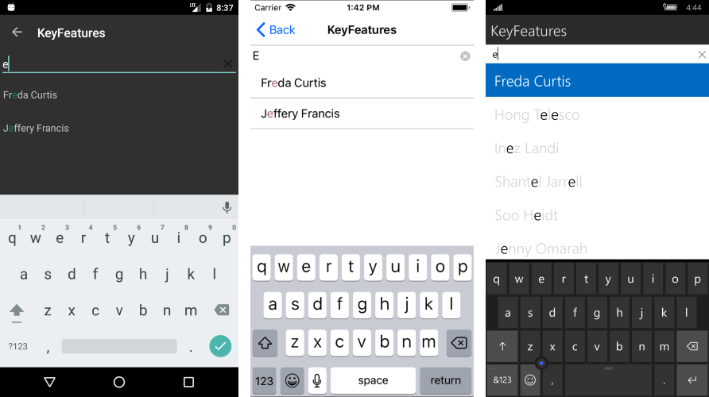
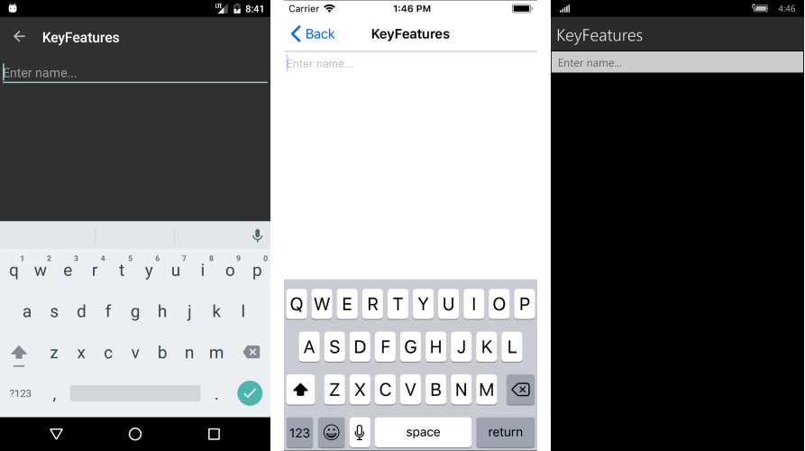
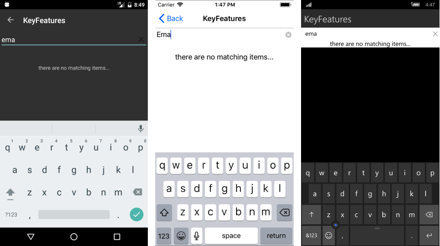

>caution RadAutoComplete control has been replaced with RadAutoCompleteView and will be removed from the suite soon. You can read about the differences between both components and how to migrate to the new RadAutoCompleteView in the kb article here: [Replace AutoComplete with AutoCompleteView]()

# Key Features

The purpose of this help article is to show you the key features of the **RadAutoComplete** control.

## Tokens Support

With AutoComplete you could enable users to search for and select several items. These items appear as tokens that can easily be deselected using their close button. 

**DisplayMode** property determines whether a single or multiple selection is enabled.  The default DisplayMode is “Plain”, for multiple selection you would need to set it to “Tokens”.

>tip Tokens support is available only for Android and iOS platforms.

<snippet id='autocomplete-features-tokenssupport'/>

#### Figure 1: Tokens Support

## Filtering Options

You can determine the filtering behavior of RadAutoComplete through the **CompletionMode** property. The available completion modes are "StartsWith" (default)  and  "Contains".

>tip In data-binding scenarios you will also need to set **TextSearchPath** property, which defines the name of the property the search function will be executed against. For more details check the [Data Binding]() topic.

<snippet id='autocomplete-features-filter'/>

#### Figure 2: Filtering options

## Watermark

RadAutoComplete exposes **Watermark** property which is used to give guidance to the end user on what should be entered in the text input. The watermark text is displayed when the control is empty.

<snippet id='autocomplete-features-watermark'/>

#### Figure 3: Watermark

## Clear Button Visibility

The Clear button, which appears at the right side of the input field when the AutoComplete is in focus, gives the end-user the option to quickly clear the entered values. You could control the visibility of the button through the **IsClearButtonVisible** property.

## NoResults Message

The NoResults message appears in the popup used for the list of suggestions whenever the control cannot find any matching items.  You could easily customize it through the **NoResultsMessage** property.

<snippet id='autocomplete-features-noresultsmessage'/>

#### Figure 3: NoResultsMessage

## Search Threshold

By default the search is triggered as soon as the user types into the input field. By using **SearchThreshold** you can configure AutoComplete to trigger the search after a certain number of letters is entered. 

<snippet id='autocomplete-features-searchthreshold'/>

## Show/hide the SuggestionView

With the **ShowSuggestionView** boolean property you can determine the visibility of the popup containing the search results of the AutoComplete.

<snippet id='autocomplete-features-suggestionview'/>

## FilteredItems collection

**FilteredItems** bindable property allows you to access the collection containing the search results of the AutoComplete. The property can be used in scenarios where the search results are visualized at a different place or inside another container.

## See Also

- [AutoComplete Getting Started]()
- [Data Binding]()
