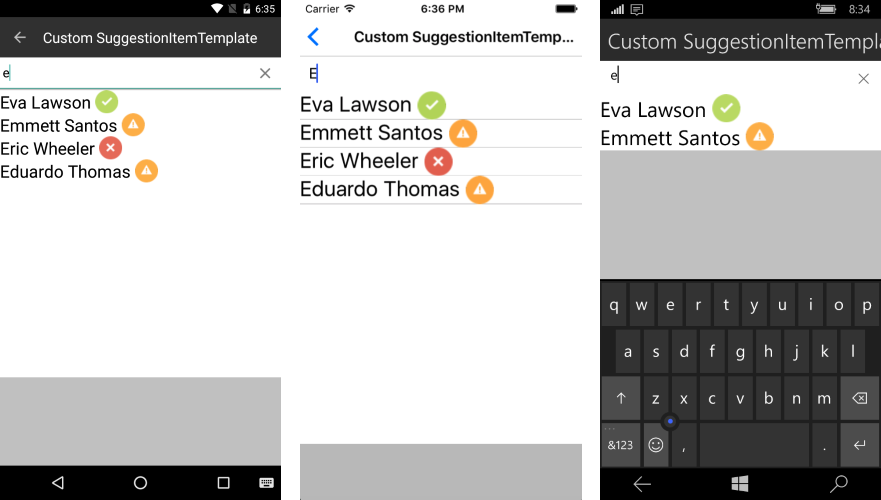

# SuggestionItemTemplate

Whenever the default templates does not fit a particular scenario customers can use the **SuggestionItemTemplate** property to define a template that will cover their needs.

- **SuggestionItemTemplate** (DataTemplate): Gets or sets the template that will be used to create each of the suggestions.

#### Example

##### Defining Business Object

<snippet id='autocomplete-data-binding-business-object'/>

##### Creating ViewModel

<snippet id='autocomplete-viewmodel'/>

##### Defining RadAutoComplete

<snippet id='autocomplete-suggestion-item-template'/>
<snippet id='autocomplete-data-binding-codebehind'/>

Here is how the customized Item template looks like:

# See Also

- [Data Binding]()