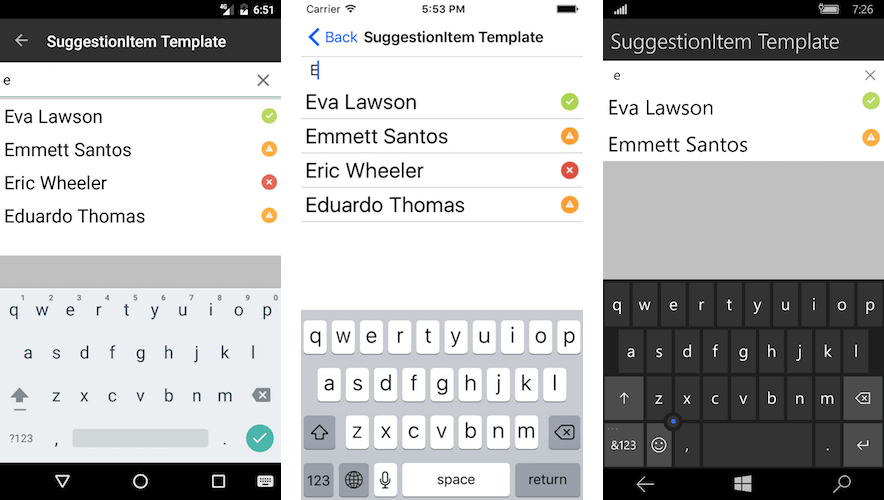

# Suggestion Items Customization

## SuggestionItemTemplate

Whenever the default templates does not fit a particular scenario customers can use the **SuggestionItemTemplate** property to define a custom template.

- **SuggestionItemTemplate** (DataTemplate): Gets or sets the template that will be used to create each of the suggestions.

### Example

This example will demonstrate how to set a custom template for the RadAutoComplete suggestion items.

Here is a sample view model that will be used as data source for the suggestions:

<snippet id='autocomplete-features-suggestion-item-template-viewmodel'/>

Here is how to setup the RadAutoComplete control:

<snippet id='autocomplete-features-suggestion-item-template'/>

Where:

<snippet id='xmlns-telerikinput'/>

Here is the result:

## Custom Highlight

With custom template the highlight of the matching strings in the auto-complete suggestions is lost. We have provided a special **RadAutoCompleteLabel** for scenarios that require highlight. Customers can use this label directly in the SuggestionItemTemplate and its text will be automatically set.

### Example

<snippet id='autocomplete-features-custom-highlight'/>

Where:

<snippet id='xmlns-telerikinput'/>

Here is the result:

## See Also

- [AutoComplete Getting Started]()
- [Data Binding]()