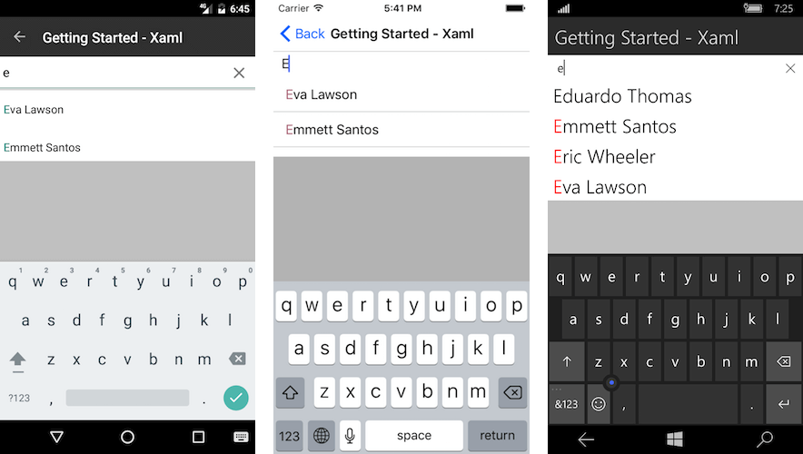

>caution RadAutoComplete control has been replaced with RadAutoCompleteView and will be removed from the suite soon. You can read about the differences between both components and how to migrate to the new RadAutoCompleteView in the kb article here: [Replace AutoComplete with AutoCompleteView]()

# Getting Started
   
This example will guide you through the steps needed to add a basic **RadAutoComplete** control in your application.

>Before you proceed, please, take a look at these articles and follow the instructions to setup your app:
>
>- [Setup on Windows]()
>- [Setup on Mac]()

## Example

If your app is setup, you are ready to add a **RadAutoComplete** control as content of your page.

<snippet id='autocomplete-getting-started-xaml'/>
<snippet id='autocomplete-getting-started-csharp'/>

In addition to this you need to add the following namespace:

<snippet id='xmlns-telerikinput'/>
<snippet id='ns-telerikinput'/>

You also have to provide an items source for the suggestions list:

<snippet id='autocomplete-getting-started-items-source'/>

Finally, set the AutoComplete as content of your page.

Here is the result:

>important **SDK Browser** and **QSF** applications contain different examples that show RadAutoComplete's main features. You can find the applications in the **Examples** and **QSF** folders of your local **Telerik UI for Xamarin** installation.