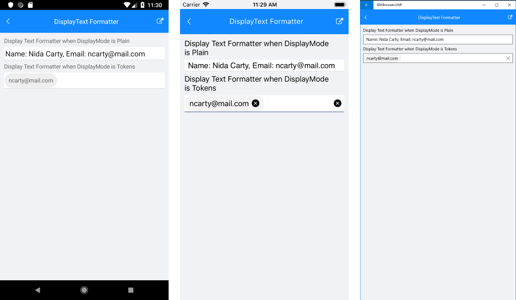

# DisplayText Formatter

RadAutoCompleteView control provides the option to format the visualized text in the input, so you could modify the displayed details of the selected item. The format of the text could be defined when AutoCompleteView DisplayMode is Plain or Tokens:

* **DisplayTextFormatter**(IDisplayTextFormatter): Defines the formatter of the selected item.

There are two options to define the formatter of the selected item:

* Set DisplayTextFortammer property and define the name of the property from the business object which will be displaied after formatting.
* Create a custom class that inherits from IDisplayTextFormatter and implement a custom logic how the selected item could be formatted.

## Example

### DisplayText Formatter with DisplayMode Plain

Here is an example how the RadAutoCompleteView DisplayText Formatter works on Plain DisplayMode:

First, create the needed business objects, for example type Client with the following properties:

<snippet id='autocompleteview-features-businessobject'/>

Then create a ViewModel with a collection of Client objects:

<snippet id='autocompleteview-features-viewmodel'/>

After that create a class for example MyBusinessObjectFormatter that inherist from IDisplayTextFormatter:

<snippet id='autocompleteview-features-text-formatter-plain-class'/>

Finally, use the following snippet to declare a RadAutoCompleteView in XAML:

<snippet id='autocompleteview-features-textformatter-plain'/>

Where the **telerikInput** namespace is the following:

<snippet id='xmlns-telerikinput'/>

### DisplayText Formatter with DisplayMode Token

Here is an example how the RadAutoCompleteView DisplayText Formatter works on Tokens:

First, create the needed business objects, for example type Client with the following properties:

<snippet id='autocompleteview-features-businessobject'/>

Then create a ViewModel with a collection of Client objects:

<snippet id='autocompleteview-features-viewmodel'/>

Finally, use the following snippet to declare a RadAutoCompleteView in XAML:

<snippet id='autocompleteview-features-textformatter-tokens'/>

Where the **telerikInput** namespace is the following:

<snippet id='xmlns-telerikinput'/>

Here is how the DisplayText Formatter looks in both cases:

>important A sample DisplayText Formatter example can be found in the AutoCompleteView/Features folder of the [SDK Samples Browser application]().

## See Also

- [Data Binding]()
- [Events]()
- [Methods]()
