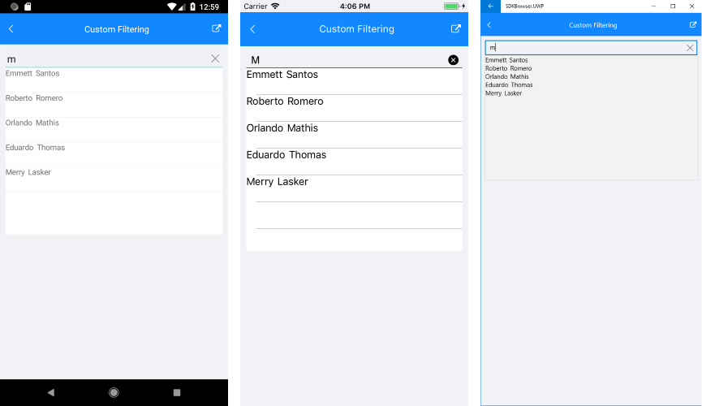

# Filtering

The RadAutoCompleteView control allows users to define custom filtering logic through the following property:

* **Filter** *(IAutoCompleteFilter)*: Defines the function that will be used to filter items. 

The IAutoCompleteFilter interface contains a **Filter** *(bool)* function  that is called by RadAutoCompleteView control in order to filter items. The Filter function provides the following properties:

* **item**: The item to be checked.
* **searchText**: The current text in the RadAutoCompleteView control.
* **completionMode**: The current CompletionMode of RadAutoCompleteView.

The function returns true when the item is added into RadAutoCompleteView FilteredItems collection, otherwise it returns false and the item won't be added into RadAutoCompleteView FilteredItems collection.

>The RadAutoCompleteView **TextSearchPath** property is required in custom filtering scenarios.

## Example

Here is an example how the RadAutoCompleteView Custom Filtering works when searching in two properties:

First, create the needed business objects, for example type Person with the following properties:

<snippet id='autocompleteview-filtering-businessobject'/>

Then create a CustomFilterViewModel with a collection of Person objects:

<snippet id='autocompleteview-filering-viewmodel'/>

After, create a class for example CustomAutoCompleteViewFilter that implements the IAutoCompleteFilter interface:

<snippet id='autocompleteview-filtering-class'/>

Finally, use the following snippet to declare a RadAutoCompleteView in XAML:

<snippet id='autocompleteview-features-customfiltering'/>

Where the **telerikInput** namespace is the following:

<snippet id='xmlns-telerikinput'/>

>important A sample Custom Filtering example can be found in the AutoCompleteView/Features folder of the [SDK Samples Browser application]().

Here is the result:

## See Also

- [Remote Search]()
- [Events]()
- [Methods](% slug autocompleteview-methods%)