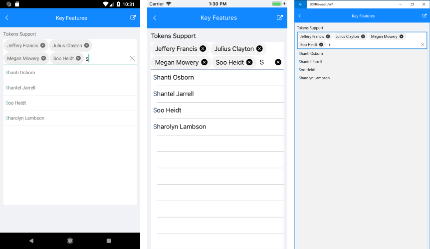

# Key Features

The purpose of this help article is to show you the key features of the **RadAutoCompleteView** control.

## Tokens Support

With AutoCompleteView you could enable users to search for and select several items. These items appear as tokens that can easily be deselected using their close button. 

**DisplayMode** *(SuggestionsDisplayMode)* property determines whether a single or multiple selection is enabled. The default DisplayMode is “Plain”, for multiple selection you would need to set it to “Tokens”.

<snippet id='autocompleteview-features-tokenssupport'/>

Here is the result when the DisplayMode is set to Tokens:



## Filtering Options

You can determine the filtering behavior of RadAutoCompleteView through the **CompletionMode** property. The available completion modes are "StartsWith" (default)  and  "Contains".

>tip In data-binding scenarios you will also need to set **TextSearchPath** property, which defines the name of the property the search function will be executed against. For more details check the [Data Binding]() topic.

<snippet id='autocompleteview-features-filter'/>

## Watermark

RadAutoCompleteView exposes **Watermark** property which is used to give guidance to the end user on what should be entered in the text input. The watermark text is displayed when the control is empty.
You could also use the **WatermarkTextColor** property to define the Watermark text color of the component.

<snippet id='autocompleteview-features-watermark'/>

## Keyboard

The **Keyboard** property of type *Xamarin.Forms.Keyboard* allows you to define the type of the keyboard that will be visualized by the device. 

```XAML
<telerikInput:RadAutoCompleteView Keyboard="Numeric" />
```

## Clear Button Visibility

The Clear button, which appears at the right side of the input field when the AutoCompleteView is on focus, gives the end-user the option to quickly clear the entered values. You could control the visibility of the button through the **IsClearButtonVisible** property.

<snippet id='autocompleteview-features-clearbutton-visibility'/>

## NoResults Message

The NoResults message appears in the popup used for the list of suggestions whenever the control cannot find any matching items.  You could use the following properties to customize the NoResult message:

* **NoResultsMessage** *(string)*: Defines the message visualized when there are no suggestions found.
* **NoResultsTemplate** *(DataTemplate)*: Defines the template visualized when there are no suggestions found.

<snippet id='autocompleteview-features-noresultsmessage'/>

## Search Threshold

By default the search is triggered as soon as the user types into the input field. By using **SearchThreshold** you can configure AutoCompleteView to trigger the search after a certain number of letters is entered. 

<snippet id='autocompleteview-features-searchthreshold'/>

## Show/Hide the SuggestionView

* **ShowSuggestionView** *(bool)*: Determine the visibility of the popup containing the search results of the AutoCompleteView.
* **SuggestionViewHeight** *(double)*: Defines the SuggestionViewHeight of the control.
* **SuggestionViewBackgroundColor**: Defines the SuggestionViewBackgroundColor of the component.

<snippet id='autocompleteview-features-suggestionview'/>

## SuggestionView Position

With R2 2022 AutoCompleteView exposes a new **SuggestionViewPosition** property which enables you to explicitly define whether the suggestions popup will be shown below or above the input field. **SuggestionViewPosition** is of enum type *Telerik.XamarinForms.Input.AutoCompleteView.PopupPosition* and can be set to any of the following values:

* (default) Auto
* Top
* Bottom

Where "Auto" calculates the available space and chooses what's the best position of the popup. In other cases, if there is no available space, the popup is repositioned as well, still, the "Top"/"Bottom" setting takes precedence.

<snippet id='autocompleteview-suggestionview-position' />

## FilteredItems collection

**FilteredItems** bindable property allows you to access the collection containing the search results of the AutoCompleteView. The property can be used in scenarios where the search results are visualized at a different place or inside another container.

>important A sample Key Features example can be found in the AutoCompleteView/Features folder of the [SDK Samples Browser application]().

## See Also

- [Styling Options]()
- [Data Binding]()
- [Events]()
