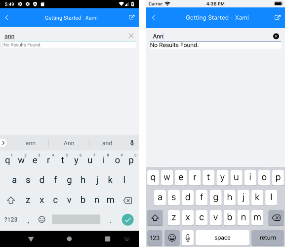

# Localization

RadAutoCompleteView for Xamarin provides language localization. In short, you can translate the used across the AutoCompleteView phrases to other languages, so that your app can be adapted to different regions.

>important To learn in details about the localization process of Telerik UI for Xamarin components, please go through the common [Localization and Globalization]() topic.

In RadAutoCompleteView you can localization the following string:

| Localization Key | Default Value |
| -----------------| ------------- |
| AutoComplete_NoResultsMessage | No Results Found. | 

The localization key refers to the default message that is shown in case there are no result corresponding to the user input:

>tip The other option for setting this message is through the **NoResultMessage** property of RadAutoCompleteView. For more details on this go to [Key Features: NoResults Message](#noresults-message).

## See Also

- [Key Features]()
- [Data Binding]()
- [Events]()
- [Filtering]()
