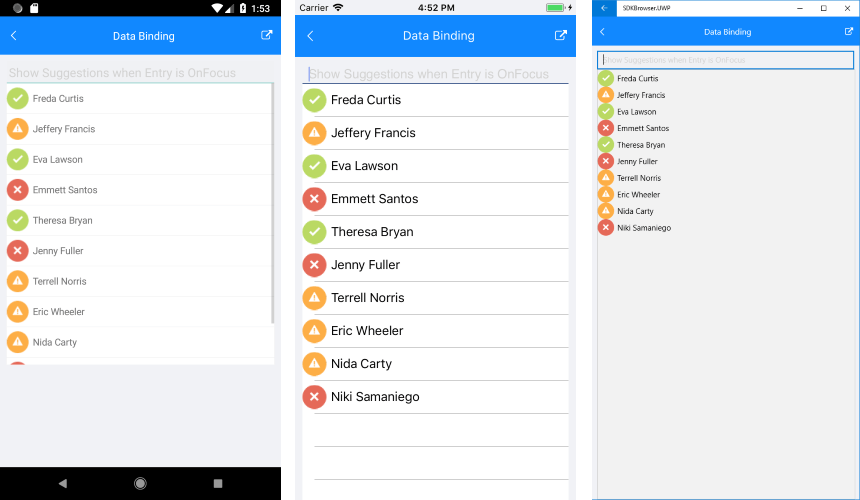

# Methods

**RadAutoCompleteView** component exposes the ability to show/hide all suggestions immediately when recieving focus.

The following methods could be used:

* **ShowSuggesstions** - Show all suggestions immediately when the RadAutoCompleteView is focused. 

* **HideSuggestions** - Hide all suggestions when the RadAutoCompleteView control is focused.

## Example

Use the following code to attach the focused event to the control:

<snippet id='autocompleteview-focused'/>

and call the ShowSuggestions method inside the event:

<snippet id='autocompleteview-showsuggestions'/>

Here is the result:

# See Also

- [Key Features]()
- [Tokens Support]()
- [Styling Options]()
