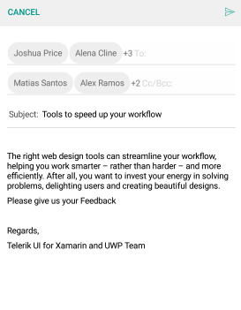

# Overview #

**RadAutoCompleteView for Xamarin** can automatically complete user input string by comparing the text being entered to all strings in the associated data source. The control provides means for easy customization and data management. Another approach you can use is the Remote Search functionality.

#### Figure 1: RadAutoCompleteView Overview

## Key features

* **Tokens Support**: With RadAutoComplete you could enable users to search for and select several items in one control. These items appear as tokens that can easily be deselected using their close button. For more details on this check [here](#tokens-support).
* **Filtering Options**:  You could define the filtering behavior to display all the matches that either “StartsWith” or “Contains” the typed symbols. Read [here](#filtering-options) for more details on this.
* **Watermark**: Used to give guidance to the end user on what should be entered in the text input. Check [here](#watermark) for more info.
* **NoResults Message**: NoResults message appears in the popup used for the list of suggestions whenever the control cannot find any matching items. Read more about this [here](#noresults-message).
* **Customizable Items**: Whenever the default template does not fit a particular scenario you could use the SuggestionItemTemplate property to define a custom template. Read [here]() for detailed instructions on how you could apply it.
* **Remote Search**: You could access your data from a remote data service. 
* **Show/Hide Suggestions**: The ability to show/hide all suggestions immediately when you focused on the input field.

## See Also

- [Getting Started]()
- [Key Features]()
- [Tokens Support]()
