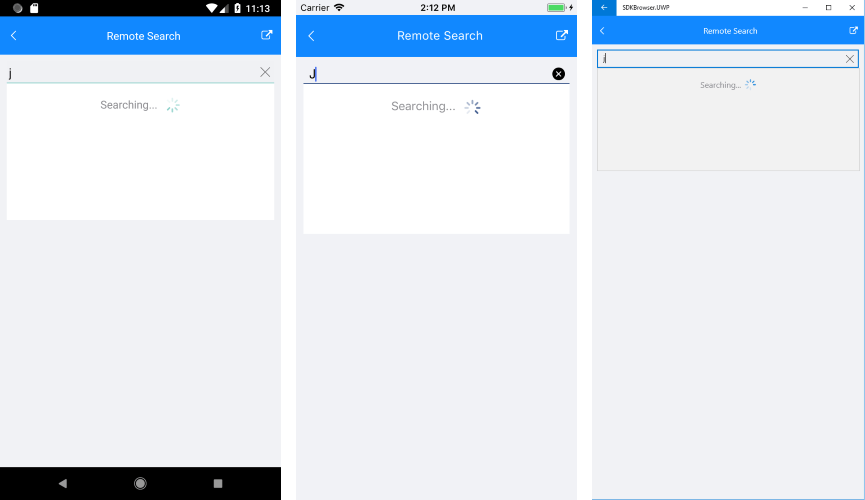
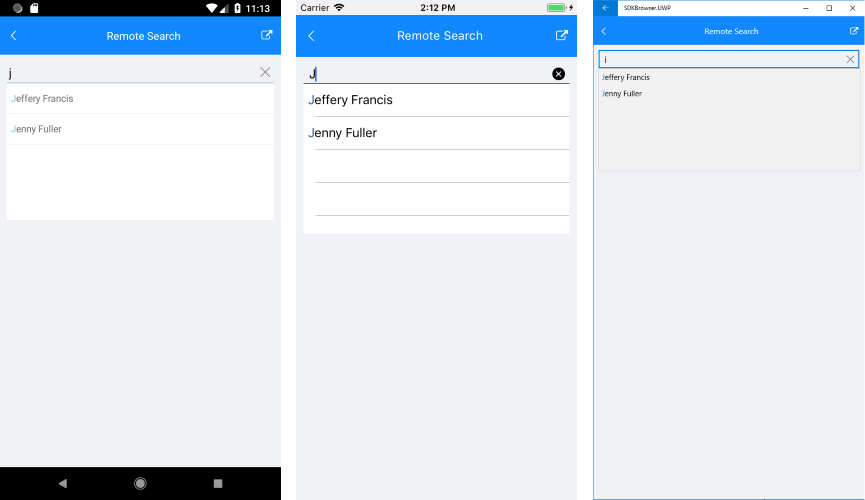

# Remote Search

The Remote Search functionality of the RadAutoCompleteView control allows you to easily take the user input, trigger custom searching algorithm and assign the results to the ItemSource of the control.

* **LoadingTemplate** *(DataTemplate)*: Defines the loading message.

Implement your custom searching algorithm inside the body of the **TextChanged** event handler. 

## Example

Here is an example how the RadAutoCompleteView Remote Search works:

First, create the needed business objects, for example type Client with the following properties:

<snippet id='autocompleteview-features-businessobject'/>

Then create a ViewModel with a collection of Client objects:

<snippet id='autocompleteview-features-viewmodel'/>

Use the following snippet to declare a RadAutoCompleteView in XAML:

<snippet id='autocompleteview-features-remote-search'/>

Where you will need to add the following namespaces:

```XAML
xmlns:telerikInput="clr-namespace:Telerik.XamarinForms.Input;assembly=Telerik.XamarinForms.Input"
xmlns:telerikPrimitives="clr-namespace:Telerik.XamarinForms.Primitives;assembly=Telerik.XamarinForms.Primitives"
```

Create a custom searching algorithm and assign the result to the control's ItemsSource inside the TextChanged event handler: 

<snippet id='autocompleteview-remote-search'/>

This is the result when LoadingTemplate is searching for results: 



This is the search complete results:



>important A sample Remote Search example can be found in the AutoCompleteView/Features folder of the [SDK Samples Browser application]().

## See Also

- [Data Binding]()
- [Events]()
- [Filtering]()
