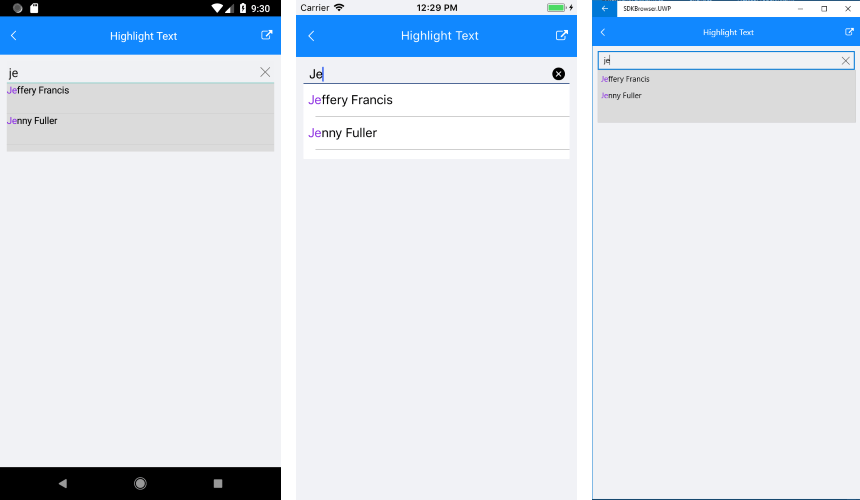

# Styling Options

RadAutoCompleteView control provides the following Style properties for customizing its look:

* **Font Options**(FontAttributes, FontFamily, FontSize): Define the font options to the text of the RadAutoCompleteView.
* **TextColor**: Defines the textcolor of the component.
* **SuggestionItemTextColor**: Defines the highlightcolor of the selection items.

Here is an example how to use the SuggestionItemTextColor property:

First, create the needed business objects, for example type Client with the following properties:

<snippet id='autocompleteview-features-businessobject'/>

Then create a ViewModel with a collection of Client objects:

<snippet id='autocompleteview-features-viewmodel'/>

Where the **telerikInput** namespace is the following:

<snippet id='xmlns-telerikinput'/>

Finally, use the following snippet to declare a RadAutoCompleteView in XAML with SuggestionItemTextColor property:

<snippet id='autocompleteview-features-highlight-text'/>

## Highlight Customization

The highlight customization can be achieved when a custom template is used. The AutoCompleteView **SuggestionItemLabel** exposes the following properties for highlight customization:

* **HighlightTextColor**
* **HighlightText**
* **UnformattedText**

### Example

First, create the needed business objects, for example type Client with the following properties:

<snippet id='autocompleteview-features-businessobject'/>

Then create a ViewModel with a collection of Client objects:

<snippet id='autocompleteview-features-viewmodel'/>

Where the **telerikInput** namespace is the following:

<snippet id='xmlns-telerikinput'/>

and the **autoCompleteView** namespace is the following:

```XAML
xmlns:autoCompleteView="clr-namespace:Telerik.XamarinForms.Input.AutoCompleteView;assembly=Telerik.XamarinForms.Input"
```

Finally, use the following snippet to declare a RadAutoCompleteView in XAML with SuggestionItemLabel property:

<snippet id='autocompleteview-features-highlight-text-behavior'/>

Here is the result:




>important A sample HighlightText example can be found on the AutoCompleteView/Features folder of the [SDK Samples Browser application]().

## See Also

- [SuggestionItemTemplate]()
- [Data Binding]()
- [Events]()
