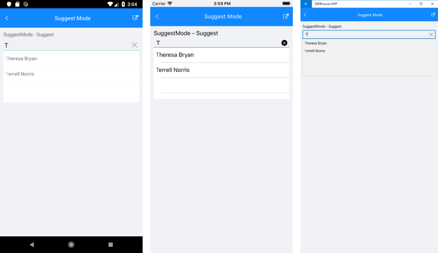
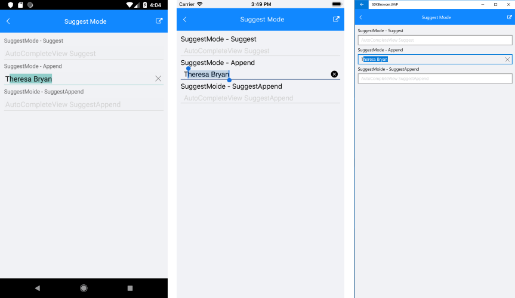
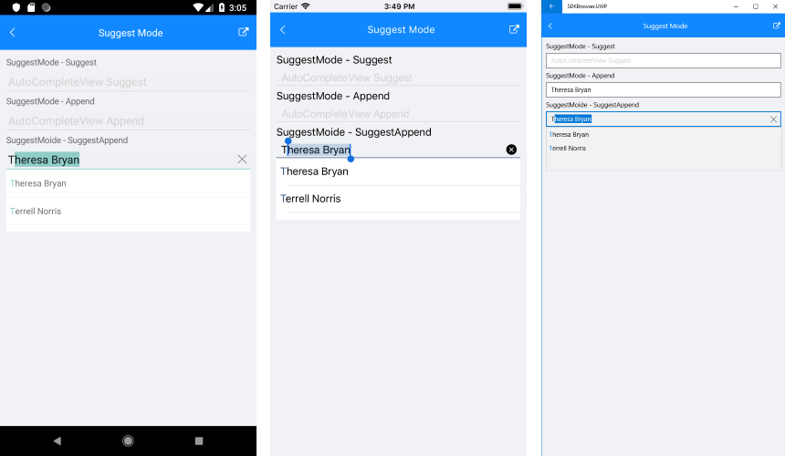

# Suggest Mode

**RadAutoCompleteView** exposes three different modes for providing suggestions:

* Suggest
* Append
* SuggestAppend

In order to choose any of those modes you should set the **SuggestMode** property of the control. The default SuggestMode is "Suggest". 

## Example

Here is an example how the RadAutoCompleteView Suggest Mode functionality works:

First, create the needed business objects, for example type Client with the following properties:

<snippet id='autocompleteview-features-businessobject'/>

Then create a ViewModel with a collection of Client objects:

<snippet id='autocompleteview-features-viewmodel'/>

For example **SuggestMode="Suggest"** property can be declared through XAML using the following snippet:

<snippet id='autocompleteview-suggestmode-suggest'/>

Here is the result when SuggestMOde is set to Suggest:

For **SuggestMode="Append"**:

<snippet id='autocompleteview-suggestmode-append'/>

And the final result:

And finaly **SuggestMode="SuggestAppend"** is declared as follow:

<snippet id='autocompleteview-suggestmode-suggest-append'/>

Here is the result:

>important A sample Suggest Mode example can be found in the AutoCompleteView/Features folder of the [SDK Samples Browser application]().

# See Also

- [Tokens Support]()
- [SuggestionItemTemplate]()
- [Remote Search]()
