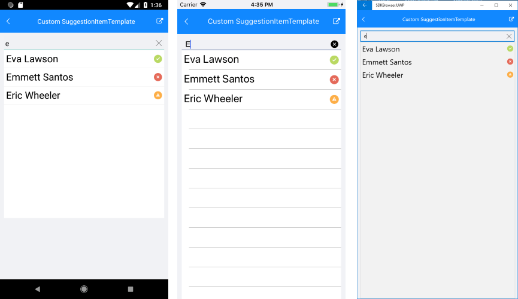

# Suggestion Items Customization

## SuggestionItemTemplate

Whenever the default template does not fit a particular scenario you can use the **SuggestionItemTemplate** property to define a custom template.

* **SuggestionItemTemplate** (DataTemplate): Defines the template that will be used to create each of the suggestions.
* **SuggestionItemTextColor**: Defines the Text Color of the suggested item of the component.

## Example

Here is an example how to use the RadAutoCompleteView SuggestionItemTemplate:

First, create the needed business objects, for example type Client with the following properties:

<snippet id='autocompleteview-features-businessobject'/>

Then create a ViewModel with a collection of Client objects:

<snippet id='autocompleteview-features-viewmodel'/>

Finally, use the following snippet to declare a RadAutoCompleteView in XAML:

<snippet id='autocompleteview-features-suggestion-item-template'/>

Where the **telerikInput** namespace is the following:

<snippet id='xmlns-telerikinput'/>

Here is the result:

>important A sample Custom SuggestionItemTemplate example can be found in the AutoCompleteView/Features folder of the [SDK Samples Browser application]().

## See Also

- [Tokens Support]()
- [Data Binding]()
