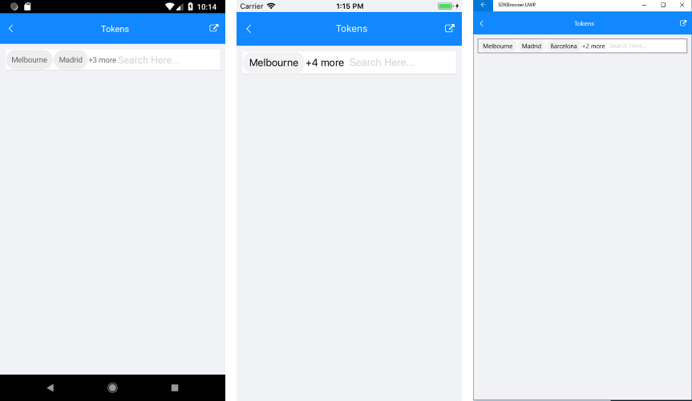

# Tokens Support - Multiple Selection

With AutoCompleteView you could enable users to search for and select several items (multiple selection). These items appear as tokens that can easily be deselected using their close button.

The Tokens Support feature exposes the following properties:

* **DisplayMode** *(SuggestionsDisplayMode)* property determines whether a single or multiple selection is enabled. The default DisplayMode is “Plain”, for multiple selection you would need to set it to “Tokens”.
* **ShowMoreItems** *(bool)*: Defines the visibility of the view that is used to represents more items. When ShowMoreItems is set to true and ShowMoreTemplate is set, the RadAutoCompleteView will hide tokens that are not on the first line and will show the hidden count. Dy default ShowMoreItems is true. If you want to hide the hidden count you should set the ShowMoreItems to false.
* **ShowMoreTemplate** *(DataTemplate)*: Defines the template used to create show more view.

## Tokens Collection

The RadAutoCompleteView control provides a readonly collection for the tokens - Tokens collection of type *ObservableCollection&lt;object&gt;*. When items are selected from the SuggestionView and DisplayMode is Tokens, these items are added to the Tokens collection. In order to track changes in the Tokens collection when items are added or removed you have to subscribe for the Tokens.CollectionChanged. 
For example:

```C#
this.autoCompleteView.Tokens.CollectionChanged;
```

```C#
private void Tokens_CollectionChanged(object sender, System.Collections.Specialized.NotifyCollectionChangedEventArgs e)
{
   
}
  
```

## Example

Here is an example how the RadAutoCompleteView Tokens feature works:

First, create the needed business objects, for example type City with the following properties:

<snippet id='autocompleteview-tokens-businessobject'/>

Then create a TokensViewModel with a collection of City objects:

<snippet id='autocompleteview-tokens'/>

Finally, use the following snippet to declare a RadAutoCompleteView in XAML:

<snippet id='autocompleteview-tokentemplate-xaml'/>

Where the **telerikInput** namespace is the following:

<snippet id='xmlns-telerikinput'/>

Here is the result when ShowMoreTemplate is used:



>important A sample Tokens example can be found in the AutoCompleteView/Features folder of the [SDK Samples Browser application]().

## See Also

- [Data Binding]()
- [Events]()
- [Methods]()
