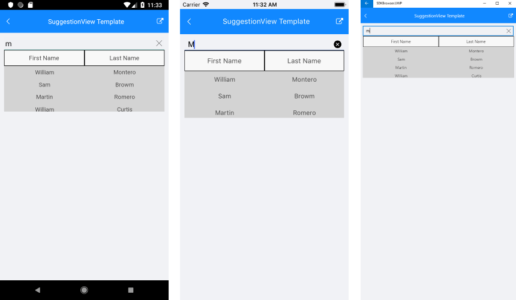

# Suggestion View Customization

## SuggestionView Template

RadAutoCompleteView provides the option to change the default template that visualize the filtered items and implement a custom template using **SuggestionViewTemplate** property.

* **SuggestionViewTemplate** (DataTemplate): Defines the template used to visualize the filtered items

## Example

Here is an example how to use the RadAutoCompleteView SuggestionViewTemplate:

First, create the needed business objects, for example type Person with the following properties:

<snippet id='autocompleteview-templates-suggestionview-businessobject'/>

Then create a ViewModel with a collection of *Person* objects:

<snippet id='autocompleteview-templates-suggestionview-viewmodel'/>

Finally, let's use the following snippet to declare a RadAutoCompleteView and its SuggestionViewTemplate with RadDataGrid in XAML:

<snippet id='autocompleteview-templates-suggestion-view-template-xaml'/>

Where you will need to add the following namespaces:

```XAML
xmlns:telerikInput="clr-namespace:Telerik.XamarinForms.Input;assembly=Telerik.XamarinForms.Input"
xmlns:telerikDataGrid="clr-namespace:Telerik.XamarinForms.DataGrid;assembly=Telerik.XamarinForms.DataGrid"
```

Here is the result:



>important A sample SuggestionView Template example can be found in the AutoCompleteView/Templates folder of the [SDK Samples Browser application]().

## See Also

- [Tokens Support]()
- [Data Binding]()
