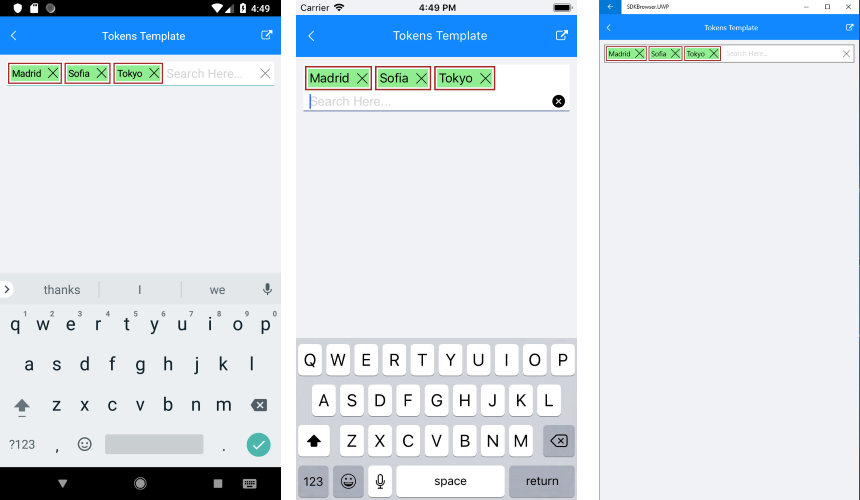

# Token Customization

## Token Template

RadAutoCompleteView provides an option to customize the template that vizualize the tokens through **TokenTemplate** property.

* **TokenTemplate** (DataTemplate): Defines the template used to vizualize the tokens.

## Example

Here is an example how to use the RadAutoCompleteView TokenTemplate:

First, create the needed business objects, for example type City with the following properties:

<snippet id='autocompleteview-tokens-businessobject'/>

Then create a ViewModel with a collection of City objects:

<snippet id='autocompleteview-tokens'/>

let's use the following snippet to declare a RadAutoCompleteView and its TokenTemplate with RadDataGrid in XAML:

<snippet id='autocompleteview-templates-token-template-xaml'/>

and the code for Label.GestureRecognizer property:

<snippet id='autocompleteview-templates-token-template-labelgesture'/>

Here is the result:

>important A sample Tokens Template example can be found in the AutoCompleteView/Templates folder of the [SDK Samples Browser application]().

## See Also

- [Tokens Support]()
- [Data Binding]()
