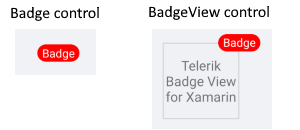

# Badge Control

## Badge vs BadgeView 



Badge is the marker which is displayed to show notifications, statuses, etc. The BadgeView is the control in which you can add a content and position the badge based on this content. 

>important We recommend you use the [BadgeView control]()

## Badge Getting Started

```XAML
<telerikPrimitives:Badge/>
```

## Badge Features

Badge has the following properties: 

* **Text**(*string*): Defines the badge text.
* **TextColor**(*Xamarin.Forms.Color*): Defines the text color of the badge.
* **TextMargin**(*Xamarin.Forms.Thickness*): Defines the margin of the badge text.
* **FontSize**(*double*): Defines the badge text font size.
* **FontFamily**(*string*): Defines the badge text font family.
* **FontAttributes**(*FontAttributes*): Defines the badge text font attributes.
* **BorderColor**(*Xamarin.Forms.Color*): Defines the badge border color.
* **CornerRadius**(*Xamarin.Forms.Thickness*): Defines the corner radius of the badge border.
* **BorderThickness**(*Xamarin.Forms.Thickness*): Defines the badge border thickness.
* **AnimationType**(*Telerik.XamarinForms.Primitives.BadgeAnimationType*). You can choose between `Scale` and `None`. The default value is `Scale`.
* **AnimationEasing**(*Xamarin.Forms.Easing*): Defines the animation easing. For more details about different easing options check the [Xamarin.Forms.Easing](https://docs.microsoft.com/en-us/xamarin/xamarin-forms/user-interface/animation/easing) article. The default value is `SinInOut`.
* **AnimationDuration** in milliseconds(*int*) Defines the animation duration in milliseconds. The default value is 300.
* **ControlTemplate**(*Xamarin.Forms.ControlTemplate*): Specifies the Badge control template.

## Badge ControlTemplate

Default ControlTemplate definition

<snippet id='badgeview-badge-control-template'/>

Define the Badge:

```XAML
<telerikPrimitives:Badge/>
```

Add the following namespace:

<snippet id='xmlns-telerikprimitives'/>

## See Also

- [BadgeView Overview]()
- [BadgeView Getting Started]()
- [Badge Position and Alignment]()
- [Badge Animation]()
- [Badge Types]()
- [Badge Styling]()
- [Badge Customization]()