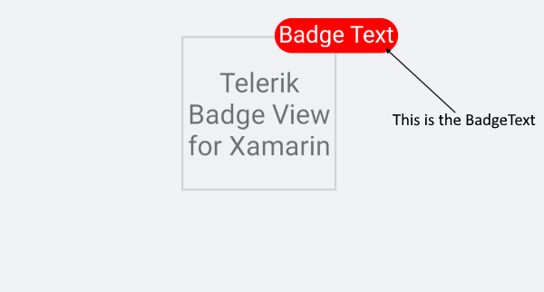
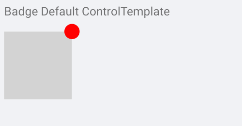
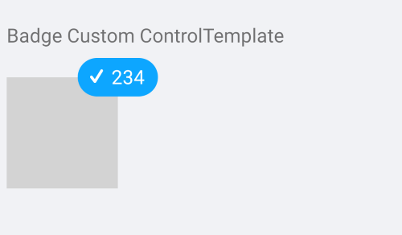

# Badge Customization

You can use te following property to specify different text inside the badge

* **BadgeText**(*string*): Defines the badge text. You can set the `BadgeText` property for example if you want to customize the text inside the badge. If you don't want to use one of the predefined badges, etc.

```XAML
<telerikPrimitives:RadBadgeView BadgeText="Badge Text">
    <telerikPrimitives:RadBadgeView.Content>
        <telerikPrimitives:RadBorder WidthRequest="80"
                                     HeightRequest="80"
                                     BorderThickness="1"
                                     BorderColor="LightGray">
            <Label Text="Telerik Badge View for Xamarin" 
                   FontSize="14"
                   VerticalTextAlignment="Center"
                   HorizontalTextAlignment="Center"/>
        </telerikPrimitives:RadBorder>
    </telerikPrimitives:RadBadgeView.Content>
</telerikPrimitives:RadBadgeView>
```

The final result:



## Badge Control Template

The Badge has a default ControlTemplate which you can customize. 

>important In order to override the default control template you will need to set implicit style with TargetType="telerikPrimitives:Badge" 

### Default ControlTemplate



Default ControlTemplate definition

<snippet id='badgeview-badge-control-template'/>

BadgeView definition

<snippet id='badgeview-controltemplate'/>

Add the following namespace:

<snippet id='xmlns-telerikprimitives'/>

## Custom ControlTemplate

BadgeView definition

<snippet id='badgeview-custom-controltemplate'/>

Custom ControlTemplate definition

<snippet id='badgeview-badge-custom-control-template'/>

Add the following namespace:

<snippet id='xmlns-telerikprimitives'/>

The final result:



>important ControlTemplate Example can be found inside the FeaturesCategory folder in [SDK Browser Application/Examples/BadgeViewControl](https://github.com/telerik/xamarin-forms-sdk/tree/master/XamarinSDK/SDKBrowser/SDKBrowser/Examples/BadgeViewControl/FeaturesCategory/ControlTemplateExample).

## See Also

- [Badge Position and Alignment]()
- [Badge Animation]()
- [Badge Types]()