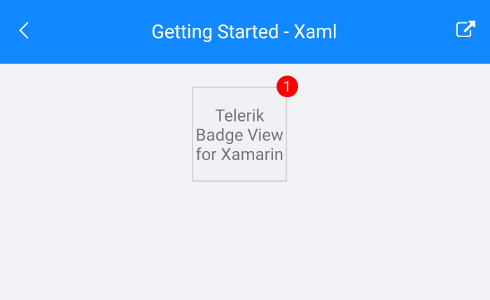

# Getting Started

This article will guide you through the steps needed to add a basic **RadBadgeView** control in your application.

* [Setting up the app](#1-setting-up-the-app)
* [Adding the required Telerik references](#2-adding-the-required-telerik-references)
* [Adding RadBadgeView control](#3-adding-radbadgeview-control)
* [Adding RadBadgeView Content](#3-adding-radbadgeview-content)

## 1. Setting up the app

Take a look at these articles and follow the instructions to setup your app:

- [Setup app with Telerik UI for Xamarin on Windows]()
- [Setup app with Telerik UI for Xamarin on Mac]()

## 2. Adding the required Telerik references

You have two options:

* Add the Telerik UI for Xamarin Nuget package following the instructions in [Telerik NuGet package server]() topic. Note that RadBadgeView does not have a separate nuget package. 

* Add the references to Telerik assemblies manually, check the list below with the required assemblies for **RadBadgeView** component:

| Platform | Assemblies |
| -------- | ---------- |
| Portable | Telerik.XamarinForms.Primitives.dll <br/>Telerik.XamarinForms.Common.dll <br/>Telerik.XamarinForms.SkiaSharp.dll |
| Android  | Telerik.XamarinForms.Primitives.dll <br/>Telerik.XamarinForms.Common.dll <br/>Telerik.XamarinForms.SkiaSharp.dll |
| iOS      | Telerik.Xamarin.iOS.dll <br/> Telerik.XamarinForms.Primitives.dll <br />Telerik.XamarinForms.Common.dll <br/>Telerik.XamarinForms.SkiaSharp.dll |
| UWP      | Telerik.Core.dll <br/>Telerik.XamarinForms.Primitives.dll <br/>Telerik.XamarinForms.Common.dll <br/>Telerik.XamarinForms.SkiaSharp.dll |

## 3. Adding RadBadgeView control

If your app is setup, you are ready to add a **RadBadgeView** control to your page. 

```XAML
<telerikPrimitives:RadBadgeView/>
```
```C#
var badge = new RadBadgeView();
```

In addition to this you need to add the following namespace:

<snippet id='xmlns-telerikprimitives'/>
<snippet id='ns-telerikprimitives'/>

## 4. Adding RadBadgeView Content and BadgeText

>important The Badge marker(indicator) which is part of the RadBadgeView will be visualized only if RadBadgeView `Content` property is set. 

## Example

Add the RadBadgeView and set `Content` property and `BadgeText` property.

<snippet id='badgeview-getting-started-xaml'/>
<snippet id='badgeview-getting-started-csharp'/>

Here is the result:

#### Figure 1: BadgeView Getting Started



>important BadgeView Getting Started Example can be found in [SDK Browser/Examples/BadgeViewControl/GettingStartedCategory](https://github.com/telerik/xamarin-forms-sdk/tree/master/XamarinSDK/SDKBrowser/SDKBrowser/Examples/BadgeViewControl/GettingStartedCategory/GettingStartedExample) folder.

## See Also

- [Key Features]()
- [Badge Position and Alignment]()
- [Badge Animation]()
- [Badge Types]()
