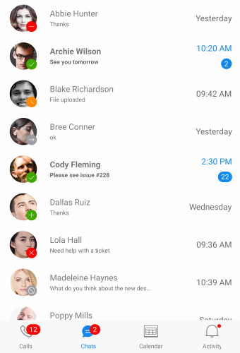

# Overview #

**Telerik BadgeView for Xamarin** allows you to display badges in your application. Badges can be used for an additional marker for any element: to decorate avatars, navigation menus, or other components in the application when the visual notification is needed.

In addition you can change the badge look setting different predefined badge types, using templates and various styling options.    

#### Figure 1: RadBadgeView Overview

## Key features

* BadgeView allows you to specify the badge **Position** based on its content. Visit the [Badge Position](#badge-position) article for more details on this feature.
* **Alignment** - You can easily align the badge according to its content. For more details about badge alignment options, visit the [Badge Alignment](#badge-alignment) article.
* You can choose whether to have an **Animation** while displaying the badge. In addition, you can specify the animation duration and animation easing. For more details and example -> navigate to [Badge Animation]() topic.
* **Predefined Badges** - You can choose in between various predefined badge types. Also, you have the option to customize and style the badge types. More information about how-to define, style and customize the predefined badges can be found in the [Predefined Badges]() article.
* **Flexible Styling API** and **Customization options** – Allows you to change the BadgeView BackgroundColor, Border Thickness and Color. Also, we have exposed API which you can use to fully customize and style the badge indicator. For more details, please visit our [Styling]() and [Customizations]() articles.

## See Also

- [Visual Structure]()
- [Getting Started]()
- [Key Features]()
- [Badge Position and Alignment]()
- [Badge Animation]()
- [Badge Types]()
- [Styling]()
- [Customization]()