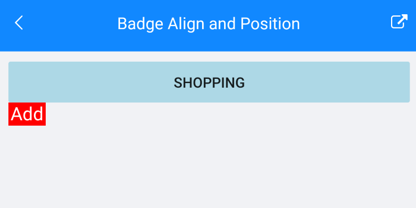

# Alignment and Position

This article explains the options you can use to align and position the badge according to the BadgeView Content.

## Badge Position

You can use the following properties to specify the position of the badge according to its content: 

* **BadgeHorizontalPosition**(of type *Telerik.XamarinForms.Primitives.BadgePosition*): Specifies the horizontal `BadgePosition` of the badge. The following options are: `Start`, `Center`, `End`. The default value is `End`.

* **BadgeVerticalPosition**(of type *Telerik.XamarinForms.Primitives. BadgePosition*): Specifies the vertical `BadgePosition` of the badge. The following options are: `Start`, `Center`, `End`. The default value is `Start`.

## Badge Alignment

You can use the following properties to specify the alignment of the badge according to its content:  

* **BadgeHorizontalAlignment**(of type *Telerik.XamarinForms.Primitives.BadgeAlignment*): Specifies the horizontal alignment of the badge. The following options are: `Start`, `Center`, `End`. The default value is `Center`.

* **BadgeVerticalAlignment**(of type *Telerik.XamarinForms.Primitives.BadgeAlignment*): Specifies the vertical alignment of the badge. The following options are: `Start`, `Center`, `End`. The default value is `End`.

## Example with Badge Alignment and Position

Here is the BadgeView definition:

<snippet id='badgeview-align-position-offset'/>

And the result:

## Badge Offset

Use the following properties to specify the horizontal/vertical distance between the content of the Badge and its alignment point:  

* **BadgeOffsetX**(*double*): Specifies the horizontal distance between the content of the Badge and its alignment point. The default value is `0`.

* **BadgeOffsetY**(*double*): Specifies the vertical distance between the content of the Badge and its alignment point. The default value is `0`.

## See Also

- [Badge Animation]()
- [Predefined Badges]()
