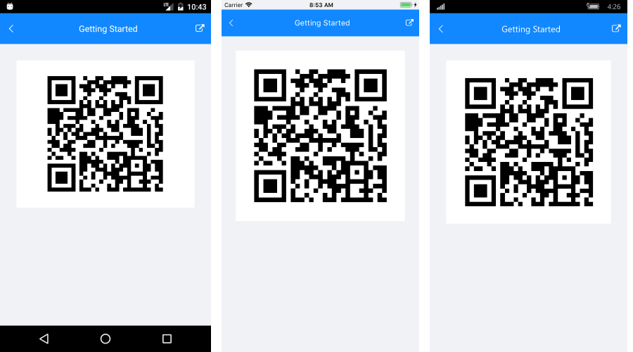

# Getting Started

This article will guide you through the steps needed to add a basic **RadBarcode** control in your application.

* [Setting up the app](#1-setting-up-the-app)
* [Adding the required Telerik references](#2-adding-the-required-telerik-references)
* [Adding RadBarcode control](#3-adding-radbarcode-control)

## 1. Setting up the app

Take a look at these articles and follow the instructions to setup your app:

- [Setup app with Telerik UI for Xamarin on Windows]()
- [Setup app with Telerik UI for Xamarin on Mac]()

## 2. Adding the required Telerik references

You have two options:

* Add the Telerik UI for Xamarin Nuget package following the instructions in [Telerik NuGet package server]() topic. Note that RadBarcode does not have a separate nuget package. 

* Add the references to Telerik assemblies manually, check the list below with the required assemblies for **RadBarcode** component:

| Platform | Assemblies |
| -------- | ---------- |
| Portable | Telerik.XamarinForms.Barcode.dll  Telerik.XamarinForms.Common.dll Telerik.XamarinForms.SkiaSharp.dll |
| Android  | Telerik.Xamarin.Android.Common.dll Telerik.XamarinForms.Barcode.dll Telerik.XamarinForms.Common.dll Telerik.XamarinForms.SkiaSharp.dll |
| iOS      | Telerik.Xamarin.iOS.dll   Telerik.XamarinForms.Barcode.dll  Telerik.XamarinForms.Common.dll Telerik.XamarinForms.SkiaSharp.dll |
| UWP      | Telerik.Core.dll Telerik.XamarinForms.Barcode.dll  Telerik.XamarinForms.Common.dll Telerik.XamarinForms.SkiaSharp.dll |

>important RadBarcode is rendered via the **SkiaSharp** graphics library so you need to install also [SkiaSharp.Views.Forms](https://www.nuget.org/packages/SkiaSharp.Views.Forms) in all projects of the Xamarin solution (.Net Standard/Shared, Android, iOS, etc). 

## 3. Adding RadBarcode control

If your app is setup, you are ready to add a **RadBarcode** control to your page. In the sample the QRCode symbology is used, for more details on the available Barcode symbologies go to [Supported Types]() topic.

<snippet id='barcode-gettingstarted' />

In addition to this you need to add the following namespace:

<snippet id='xmlns-telerikbarcode'/>

Here is the result:

#### Figure 1: Barcode Getting Started

>important **SDK Browser** and **QSF** applications contain different examples that show RadAutoComplete's main features. You can find the applications in the **Examples** and **QSF** folders of your local **Telerik UI for Xamarin** installation.

## See Also

- [Key Features]()
- [Supported Barcodes]()
