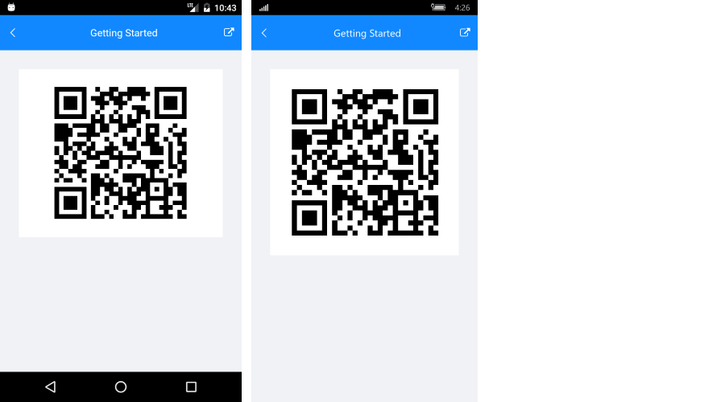

# Getting Started
   
This example will guide you through the steps needed to add a basic **RadBarcode** control in your application.

>Before you proceed, please, take a look at these articles and follow the instructions to setup your app:
>
>- [Setup on Windows]()
>- [Setup on Mac]()

## Example

If your app is setup, you are ready to add a **RadBarcode** control to your page. In the sample the QRCode symbology is used, for more details on the available Barcode symbologies go to [Supported Types]() topic.

<snippet id='barcode-getting-started'/>

In addition to this you need to add the following namespace:

<snippet id='xmlns-telerikbarcode'/>

Here is the result:

#### Figure 1: Barcode Getting Started

>important **SDK Browser** and **QSF** applications contain different examples that show RadAutoComplete's main features. You can find the applications in the **Examples** and **QSF** folders of your local **Telerik UI for Xamarin** installation.

## See Also

- [Key Features]()
- [Supported Barcodes]()